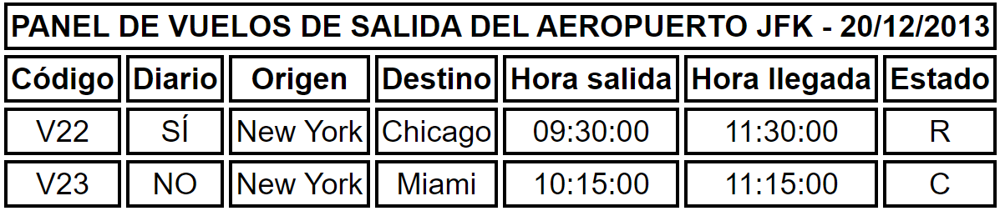

<style>
  h1{
    border: none;
    margin-bottom: 0px;
    text-align: center;
    font-weight: bold;
  }

  p{
    text-align: justify;
  }
</style>

<h1>SEGUNDA RELACIÓN</h1>

<hr>

<p><b>1. El siguiente documento XML está bien formado. Sin embargo, no es válido. Para que lo sea, realiza los cambios necesarios en dicho documento, pero sin modificar la DTD interna.</b></p>

```xml
<?xml version="1.0" encoding="UTF-8"?>

<!DOCTYPE perifericos[
  <!ELEMENT perifericos(#PCDATA)>
]>

<perifericos>
  <periferico>impresora</periferico>

  <periferico>monitor</periferico>

  <periferico>teclado</periferico>
</perifericos>
```

<p>Respuesta:</p>

```xml
<?xml version="1.0" encoding="UTF-8"?>

<!DOCTYPE perifericos[
  <!ELEMENT periferico(#PCDATA)>
]>

<perifericos>
  <periferico>impresora, monitor, teclado</periferico>
</perifericos>
```

<p><b>2. Los siguientes documentos no son válidos porque contienen uno o dos errores (los errores no están en la DTD interna). Corrige los errores.</b></p>

<p><b>a. Números</b></p>

```xml
<?xml version="1.0" encoding="UTF-8"?>

<!DOCTYPE numeros[
  <!ELEMENT numeros(#PCDATA)>
]>

<numeros>
  <numero>25</numero>
</numeros>
```

<p>Respuesta:</p>

```xml
<?xml version="1.0" encoding="UTF-8"?>

<!DOCTYPE numeros[
  <!ELEMENT numeros(#PCDATA)>
]>

<numeros>25</numeros>
```

<p><b>b. Letras</b></p>

```xml
<?xml version="1.0" encoding="UTF-8"?>

<!DOCTYPE letras[
  <!ELEMENT letras(letra)>
  <!ELEMENT letra(#PCDATA)>
]>

<letras>
  <letra>m</letra>

  <letra>uve doble</letra>
</letras>
```

<p>Respuesta:</p>

```xml
<!-- creo que ya es válido -->

<?xml version="1.0" encoding="UTF-8"?>

<!DOCTYPE letras[
  <!ELEMENT letras(letra)>
  <!ELEMENT letra(#PCDATA)>
]>

<letras>
  <letra>m</letra>

  <letra>uve doble</letra>
</letras>
```

<p><b>c. Colores</b></p>

```xml
<?xml version="1.0" encoding="UTF-8"?>

<!DOCTYPE colores[
  <!ELEMENT colores(color*)>
  <!ELEMENT color(#PCDATA)>
]>

<colores>
  <color>azul marino</color>

  negro

  <color>amarillo</color>
</colores>
```

<p>Respuesta:</p>

```xml
<!-- primer caso | no aparece ningún elemento "color" -->

<?xml version="1.0" encoding="UTF-8"?>

<!DOCTYPE colores[
  <!ELEMENT colores(color*)>
  <!ELEMENT color(#PCDATA)>
]>

<colores></colores>
```

```xml
<!-- segundo caso | aparecen n elementos "color" -->

<?xml version="1.0" encoding="UTF-8"?>

<!DOCTYPE colores[
  <!ELEMENT colores(color*)>
  <!ELEMENT color(#PCDATA)>
]>

<colores>
  <color>azul marino</color>

  <color>negro</color>

  <color>amarillo</color>
</colores>
```

<p><b>d. Flores</b></p>

```xml
<?xml version="1.0" encoding="UTF-8"?>

<!DOCTYPE flores[
  <!ELEMENT flores(flor+)>
  <!ELEMENT flor(#PCDATA)>
]>

<flores>
</flores>
```

<p>Respuesta:</p>

```xml
<!-- primer caso | aparece 1 elemento "flor" -->

<?xml version="1.0" encoding="UTF-8"?>

<!DOCTYPE flores[
  <!ELEMENT flores(flor+)>
  <!ELEMENT flor(#PCDATA)>
]>

<flores>
  <flor>rosa</flor>
</flores>
```

```xml
<!-- segundo caso | aparecen n elementos "flor" -->

<?xml version="1.0" encoding="UTF-8"?>

<!DOCTYPE flores[
  <!ELEMENT flores(flor+)>
  <!ELEMENT flor(#PCDATA)>
]>

<flores>
  <flor>rosa</flor>

  <flor>lirio</flor>

  <flor>tulipán</flor>
</flores>
```

<p><b>e. Animales</b></p>

```xml
<?xml version="1.0" encoding="UTF-8"?>

<!DOCTYPE animales[
  <!ELEMENT animales(animal*)>
  <!ELEMENT animal(#PCDATA)>
]>

<animales>
  <perro>caniche</perro>

  <gato>siamés</gato>
</animales>
```

<p>Respuesta:</p>

```xml
<!-- primer caso | no aparece ningún elemento "animal" -->

<?xml version="1.0" encoding="UTF-8"?>

<!DOCTYPE animales[
  <!ELEMENT animales(animal*)>
  <!ELEMENT animal(#PCDATA)>
]>

<animales></animales>
```

```xml
<!-- segundo caso | aparecen n elementos "animal" -->

<?xml version="1.0" encoding="UTF-8"?>

<!DOCTYPE animales[
  <!ELEMENT animales(animal*)>
  <!ELEMENT animal(#PCDATA)>
]>

<animales>
  <animal>caniche</animal>

  <animal>siamés</animal>
</animales>
```

<p><b>f. Escritores</b></p>

```xml
<?xml version="1.0" encoding="UTF-8"?>

<!DOCTYPE escritores[
  <!ELEMENT escritores(escritor*)>
  <!ELEMENT escritor(nombre, nacimiento)>
  <!ELEMENT nombre(#PCDATA)>
  <!ELEMENT nacimiento(#PCDATA)>
]>

<escritores>
  <escritor>
    <nombre>mario vargas llosa</nombre>

    <nacimiento>28 de marzo de 1936</nacimiento>
  </escritor>

  <escritor>
    <nacimiento>1 de abril de 1929</nacimiento>

    <nombre>milan kundera</nombre>
  </escritor>
</escritores>
```

<p>Respuesta:</p>

```xml
<!-- primer caso | no aparece ningún elemento "escritor" -->

<?xml version="1.0" encoding="UTF-8"?>

<!DOCTYPE escritores[
  <!ELEMENT escritores(escritor*)>
  <!ELEMENT escritor(nombre, nacimiento)>
  <!ELEMENT nombre(#PCDATA)>
  <!ELEMENT nacimiento(#PCDATA)>
]>

<escritores></escritores>
```

```xml
<!-- segundo caso | aparecen n elementos "escritor" -->

<?xml version="1.0" encoding="UTF-8"?>

<!DOCTYPE escritores[
  <!ELEMENT escritores(escritor*)>
  <!ELEMENT escritor(nombre, nacimiento)>
  <!ELEMENT nombre(#PCDATA)>
  <!ELEMENT nacimiento(#PCDATA)>
]>

<escritores>
  <escritor>
    <nombre>mario vargas llosa</nombre>

    <nacimiento>28 de marzo de 1936</nacimiento>
  </escritor>

  <escritor>
    <nombre>milan kundera</nombre>

    <nacimiento>1 de abril de 1929</nacimiento>
  </escritor>
</escritores>
```

<p><b>g. Músicos</b></p>

```xml
<?xml version="1.0" encoding="UTF-8"?>

<!DOCTYPE musicos[
  <!ELEMENT musicos(musico*)>
  <!ELEMENT musico((nombre | apodo), fechaNacimiento)>
  <!ELEMENT nombre(#PCDATA)>
  <!ELEMENT apodo(#PCDATA)>
  <!ELEMENT fechaNacimiento(#PCDATA)>
]>

<musicos>
  <musico>
    <nombre>antonio vivaldi</nombre>

    <apodo>el cura pelirrojo</apodo>

    <fechaNacimiento>4 de marzo de              1678</fechaNacimiento>
  </musico>

  <musico>
    <nombre>johann sebastian bach</nombre>

    <apodo>el viejo peluca</apodo>

    <fechaNacimiento>21 de marzo de              1685</fechaNacimiento>
  </musico>
</musicos>
```

<p>Respuesta:</p>

```xml
<!-- primer caso | no aparece ningún elemento "musico" -->

<?xml version="1.0" encoding="UTF-8"?>

<!DOCTYPE musicos[
  <!ELEMENT musicos(musico*)>
  <!ELEMENT musico((nombre | apodo), fechaNacimiento)>
  <!ELEMENT nombre(#PCDATA)>
  <!ELEMENT apodo(#PCDATA)>
  <!ELEMENT fechaNacimiento(#PCDATA)>
]>

<musicos></musicos>
```

```xml
<!-- segundo caso | aparecen n elementos "musico" -->

<?xml version="1.0" encoding="UTF-8"?>

<!DOCTYPE musicos[
  <!ELEMENT musicos(musico*)>
  <!ELEMENT musico((nombre | apodo), fechaNacimiento)>
  <!ELEMENT nombre(#PCDATA)>
  <!ELEMENT apodo(#PCDATA)>
  <!ELEMENT fechaNacimiento(#PCDATA)>
]>

<musicos>
  <musico>
    <nombre>antonio vivaldi</nombre>

    <fechaNacimiento>4 de marzo de 1678</fechaNacimiento>
  </musico>

  <musico>
    <apodo>el viejo peluca</apodo>

    <fechaNacimiento>21 de marzo de 1685</fechaNacimiento>
  </musico>
</musicos>
```

<p><b>h. Teléfonos de emergencia</b></p>

```xml
<?xml version="1.0" encoding="UTF-8"?>

<!DOCTYPE agenda[
  <!ELEMENT agenda(contacto*)>
  <!ELEMENT contacto(nombre, telefonoFijo*, telefonoMovil+)>
  <!ELEMENT nombre(#PCDATA)>
  <!ELEMENT telefonoFijo(#PCDATA)>
  <!ELEMENT telefonoMovil(#PCDATA)>
]>

<agenda>
  <contacto>
    <nombre>ayuntamiento</nombre>

    <telefonoFijo>010</telefonoFijo>
  </contacto>

  <contacto>
    <nombre>emergencias</nombre>

    <telefonoFijo>112 (unión europea)</telefonoFijo>

    <telefonoMovil>desconocido</telefonoMovil>

    <telefonoFijo>911 (estados unidos)</telefonoFijo>
  </contacto>
</agenda>
```

<p>Respuesta:</p>

```xml
<!-- primer caso | no aparece ningún elemento "contacto" -->

<?xml version="1.0" encoding="UTF-8"?>

<!DOCTYPE agenda[
  <!ELEMENT agenda(contacto*)>
  <!ELEMENT contacto(nombre, telefonoFijo*, telefonoMovil+)>
  <!ELEMENT nombre(#PCDATA)>
  <!ELEMENT telefonoFijo(#PCDATA)>
  <!ELEMENT telefonoMovil(#PCDATA)>
]>

<agenda></agenda>
```

```xml
<!-- segundo caso | aparecen n elementos "contacto" -->

<?xml version="1.0" encoding="UTF-8"?>

<!DOCTYPE agenda[
  <!ELEMENT agenda(contacto*)>
  <!ELEMENT contacto(nombre, telefonoFijo*, telefonoMovil+)>
  <!ELEMENT nombre(#PCDATA)>
  <!ELEMENT telefonoFijo(#PCDATA)>
  <!ELEMENT telefonoMovil(#PCDATA)>
]>

<agenda>
  <contacto>
    <nombre>ayuntamiento</nombre>

    <telefonoFijo>010</telefonoFijo>

    <telefonoMovil>611 11 11 11</telefonoMovil>
  </contacto>

  <contacto>
    <nombre>emergencias</nombre>

    <telefonoMovil>622 22 22 22</telefonoMovil>
  </contacto>
</agenda>
```

```xml
<!-- tercer caso | no aparece ningún elemento "telefonoFijo" y solo aparece 1 elemento "telefonoMovil" -->

<?xml version="1.0" encoding="UTF-8"?>

<!DOCTYPE agenda[
  <!ELEMENT agenda(contacto*)>
  <!ELEMENT contacto(nombre, telefonoFijo*, telefonoMovil+)>
  <!ELEMENT nombre(#PCDATA)>
  <!ELEMENT telefonoFijo(#PCDATA)>
  <!ELEMENT telefonoMovil(#PCDATA)>
]>

<agenda>
  <contacto>
    <nombre>ayuntamiento</nombre>

    <telefonoMovil>611 11 11 11</telefonoMovil>
  </contacto>

  <contacto>
    <nombre>emergencias</nombre>

    <telefonoMovil>622 22 22 22</telefonoMovil>
  </contacto>
</agenda>
```

```xml
<!-- cuarto caso | no aparece ningún elemento "telefonoFijo" y aparecen n elementos "telefonoMovil" -->

<?xml version="1.0" encoding="UTF-8"?>

<!DOCTYPE agenda[
  <!ELEMENT agenda(contacto*)>
  <!ELEMENT contacto(nombre, telefonoFijo*, telefonoMovil+)>
  <!ELEMENT nombre(#PCDATA)>
  <!ELEMENT telefonoFijo(#PCDATA)>
  <!ELEMENT telefonoMovil(#PCDATA)>
]>

<agenda>
  <contacto>
    <nombre>ayuntamiento</nombre>

    <telefonoMovil>611 11 11 11</telefonoMovil>

    <telefonoMovil>633 33 33 33</telefonoMovil>
  </contacto>

  <contacto>
    <nombre>emergencias</nombre>

    <telefonoMovil>622 22 22 22</telefonoMovil>

    <telefonoMovil>644 44 44 44</telefonoMovil>
  </contacto>
</agenda>
```

```xml
<!-- quinto caso | aparecen n elementos "telefonoFijo" y solo aparece 1 elemento "telefonoMovil" -->

<?xml version="1.0" encoding="UTF-8"?>

<!DOCTYPE agenda[
  <!ELEMENT agenda(contacto*)>
  <!ELEMENT contacto(nombre, telefonoFijo*, telefonoMovil+)>
  <!ELEMENT nombre(#PCDATA)>
  <!ELEMENT telefonoFijo(#PCDATA)>
  <!ELEMENT telefonoMovil(#PCDATA)>
]>

<agenda>
  <contacto>
    <nombre>ayuntamiento</nombre>

    <telefonoFijo>010</telefonoFijo>

    <telefonoFijo>020</telefonoFijo>

    <telefonoMovil>611 11 11 11</telefonoMovil>
  </contacto>

  <contacto>
    <nombre>emergencias</nombre>

    <telefonoFijo>112</telefonoFijo>

    <telefonoFijo>911</telefonoFijo>

    <telefonoMovil>622 22 22 22</telefonoMovil>
  </contacto>
</agenda>
```

```xml
<!-- sexto caso | aparecen n elementos "telefonoFijo" y aparecen n elementos "telefonoMovil" -->

<?xml version="1.0" encoding="UTF-8"?>

<!DOCTYPE agenda[
  <!ELEMENT agenda(contacto*)>
  <!ELEMENT contacto(nombre, telefonoFijo*, telefonoMovil+)>
  <!ELEMENT nombre(#PCDATA)>
  <!ELEMENT telefonoFijo(#PCDATA)>
  <!ELEMENT telefonoMovil(#PCDATA)>
]>

<agenda>
  <contacto>
    <nombre>ayuntamiento</nombre>

    <telefonoFijo>010</telefonoFijo>

    <telefonoFijo>020</telefonoFijo>

    <telefonoMovil>611 11 11 11</telefonoMovil>

    <telefonoMovil>633 33 33 33</telefonoMovil>
  </contacto>

  <contacto>
    <nombre>emergencias</nombre>

    <telefonoFijo>112</telefonoFijo>

    <telefonoFijo>911</telefonoFijo>

    <telefonoMovil>622 22 22 22</telefonoMovil>

    <telefonoMovil>644 44 44 44</telefonoMovil>
  </contacto>
</agenda>
```

<p><b>i. El Sistema Solar</b></p>

```xml
<?xml version="1.0" encoding="UTF-8"?>

<!DOCTYPE sistemaSolar[
  <!ELEMENT sistemaSolar(cuerpo*)>
  <!ELEMENT cuerpo(planeta | satelite | asteroide)>
  <!ELEMENT planeta(#PCDATA)>
  <!ELEMENT satelite(#PCDATA)>
  <!ELEMENT asteroide(#PCDATA)>
]>

<sistemaSolar>
  <cuerpo>
    <planeta>tierra</planeta>

    <satelite>luna</satelite>
  </cuerpo>

  <asteroide>ceres</asteroide>
</sistemaSolar>
```

<p>Respuesta:</p>

```xml
<!-- primer caso | no aparece ningún elemento "cuerpo" -->

<?xml version="1.0" encoding="UTF-8"?>

<!DOCTYPE sistemaSolar[
  <!ELEMENT sistemaSolar(cuerpo*)>
  <!ELEMENT cuerpo(planeta | satelite | asteroide)>
  <!ELEMENT planeta(#PCDATA)>
  <!ELEMENT satelite(#PCDATA)>
  <!ELEMENT asteroide(#PCDATA)>
]>

<sistemaSolar></sistemaSolar>
```

```xml
<!-- segundo caso | aparecen n elementos "cuerpo" y aparece un elemento "planeta", otro "satelite" y otro "asteroide", pero no todos a la vez en un mismo elemento -->

<?xml version="1.0" encoding="UTF-8"?>

<!DOCTYPE sistemaSolar[
  <!ELEMENT sistemaSolar(cuerpo*)>
  <!ELEMENT cuerpo(planeta | satelite | asteroide)>
  <!ELEMENT planeta(#PCDATA)>
  <!ELEMENT satelite(#PCDATA)>
  <!ELEMENT asteroide(#PCDATA)>
]>

<sistemaSolar>
  <cuerpo>
    <planeta>tierra</planeta>
  </cuerpo>

  <cuerpo>
    <satelite>luna</satelite>
  </cuerpo>

  <cuerpo>
    <asteroide>ceres</asteroide>
  </cuerpo>
</sistemaSolar>
```

<p><b>3. Los siguientes documentos no son válidos porque contienen errores (los errores están en el DTD interno). Corrige los errores. Intenta elegir la manera más sencilla de corregir el DTD, ya que casi siempre hay varias maneras distintas.</b></p>

<p><b>a. Marcadores</b></p>

```xml
<?xml version="1.0" encoding="UTF-8"?>

<!DOCTYPE favoritos[
  <!ELEMENT favoritos(marcador)>
  <!ELEMENT marcador(nombre, uri)>
  <!ELEMENT nombre(#PCDATA)>
  <!ELEMENT uri(#PCDATA)>
]>

<marcadores>
  <marcador>
    <nombre>w3c</nombre>

    <uri>http://eee.w3.org</uri>
  </marcador>

  <marcador>
    <nombre>web hypertext application technology working group (whatwg)</nombre>

    <uri>http://www.whatwg.org</uri>
  </marcador>
</marcadores>
```

<p>Respuesta:</p>

```xml
<?xml version="1.0" encoding="UTF-8"?>

<!DOCTYPE marcadores[
  <!ELEMENT marcadores(marcador*)>
  <!ELEMENT marcador(nombre, uri)>
  <!ELEMENT nombre(#PCDATA)>
  <!ELEMENT uri(#PCDATA)>
]>

<marcadores>
  <marcador>
    <nombre>w3c</nombre>

    <uri>http://eee.w3.org</uri>
  </marcador>

  <marcador>
    <nombre>web hypertext application technology working group (whatwg)</nombre>

    <uri>http://www.whatwg.org</uri>
  </marcador>
</marcadores>
```

<p><b>b. Efemérides</b></p>

```xml
<?xml version="1.0" encoding="UTF-8"?>

<!DOCTYPE efemerides[
  <!ELEMENT efemerides(efemeride)>
  <!ELEMENT efemeride(fecha, hecho)>
]>

<efemerides>
  <efemeride>
    <fecha>20 de julio de 1969</fecha>

    <hecho>llegada del hombre a la luna</hecho>
  </efemeride>

  <efemeride>
    <fecha>12 de octubre de 1492</fecha>

    <hecho>llegada de colón a américa</hecho>
  </efemeride>

  <efemeride>
    <fecha>6 de abril de 1909</fecha>

    <hecho>llegada de robert peary al polo norte</hecho>
  </efemeride>
</efemerides>
```

<p>Respuesta:</p>

```xml
<?xml version="1.0" encoding="UTF-8"?>

<!DOCTYPE efemerides[
  <!ELEMENT efemerides(efemeride+)>
  <!ELEMENT efemeride(fecha, hecho)>
  <!ELEMENT fecha(#PCDATA)>
  <!ELEMENT hecho(#PCDATA)>
]>

<efemerides>
  <efemeride>
    <fecha>20 de julio de 1969</fecha>

    <hecho>llegada del hombre a la luna</hecho>
  </efemeride>

  <efemeride>
    <fecha>12 de octubre de 1492</fecha>

    <hecho>llegada de colón a américa</hecho>
  </efemeride>

  <efemeride>
    <fecha>6 de abril de 1909</fecha>

    <hecho>llegada de robert peary al polo norte</hecho>
  </efemeride>
</efemerides>
```

<p><b>c. Aeropuertos</b></p>

```xml
<?xml version="1.0" encoding="UTF-8"?>

DOCTYPE areopuertos[
  <!ELEMENT aeropuertos(aeropuerto*)>
  <!ELEMENT aeropuerto(nombre, cerrado)>
  <!ELEMENT nombre(#PCDATA)>
  <!ELEMENT cerrado(#PCDATA)>
]>

<aeropuertos>
  <aeropuerto>
    <nombre>berlín schönefeld (sfx)</nombre>
  </aeropuerto>

  <aeropuerto>
    <nombre>berlín tempelhof (thf)</nombre>

    <cerrado/>
  </aeropuerto>
</aeropuertos>
```

<p>Respuesta:</p>

```xml
<?xml version="1.0" encoding="UTF-8"?>

<!DOCTYPE areopuertos[
  <!ELEMENT aeropuertos(aeropuerto*)>
  <!ELEMENT aeropuerto(nombre, cerrado?)>
  <!ELEMENT nombre(#PCDATA)>
  <!ELEMENT cerrado(#PCDATA)>
]>

<aeropuertos>
  <aeropuerto>
    <nombre>berlín schönefeld (sfx)</nombre>
  </aeropuerto>

  <aeropuerto>
    <nombre>berlín tempelhof (thf)</nombre>

    <cerrado/>
  </aeropuerto>
</aeropuertos>
```

<p><b>d. Reyes españoles</b></p>

```xml
<?xml version="1.0" encoding="UTF-8"?>

<!DOCTYPE reyesEspanoles[
  ELEMENT reyesEspanoles(rey*, reina*)>
  <!ELEMENT rey(nombre, padre, madre)>
  <!ELEMENT padre(#PCDATA)>
  <!ELEMENT madre(#PCDATA)>
]>

<reyesEspanoles>
  <rey>
    <nombre>felipe iii</nombre>

    <padre>felipe ii</padre>

    <madre>ana de austria</madre>
  </rey>

  <reina>
    <nombre>juana la loca</nombre>

    <padre>fernando el católico</padre>

    <madre>isabel la católica</madre>
  </reina>

  <rey>
    <nombre>carlos i</nombre>

    <padre>felipe el hermoso</padre>

    <madre>juana la loca</madre>
  </rey>
</reyesEspanoles>
```

<p>Respuesta:</p>

```xml
<?xml version="1.0" encoding="UTF-8"?>

<!DOCTYPE reyesEspanoles[
  <!ELEMENT reyesEspanoles(rey*, reina*)>
  <!ELEMENT rey(nombre, padre, madre)>
  <!ELEMENT nombre(#PCDATA)>
  <!ELEMENT padre(#PCDATA)>
  <!ELEMENT madre(#PCDATA)>
]>

<reyesEspanoles>
  <rey>
    <nombre>felipe iii</nombre>

    <padre>felipe ii</padre>

    <madre>ana de austria</madre>
  </rey>

  <reina>
    <nombre>juana la loca</nombre>

    <padre>fernando el católico</padre>

    <madre>isabel la católica</madre>
  </reina>

  <rey>
    <nombre>carlos i</nombre>

    <padre>felipe el hermoso</padre>

    <madre>juana la loca</madre>
  </rey>
</reyesEspanoles>
```

<p><b>e. Códigos de colores</b></p>

```xml
<?xml version="1.0" encoding="UTF-8"?>

<!DOCTYPE colores[
  <!ELEMENT colores(color*)>
  <!ELEMENT nombreSvg(#PCDATA)>
  <!ELEMENT rgb(#PCDATA)>
  <!ELEMENT cmyk(#PCDATA)>
]>

<colores>
  <color>
    <nombreSvg>purple</nombreSvg>

    <codigo>
      <rgb>#800080</rgb>
    </codigo>
  </color>

  <color>
    <nombreSvg>purple</nombreSvg>

    <codigo>
      <cmyk>#00FF007F</cmyk>
    </codigo>
  </color>
</colores>
```

<p>Respuesta:</p>

```xml
<?xml version="1.0" encoding="UTF-8"?>

<!DOCTYPE colores[
  <!ELEMENT colores(color*)>
  <!ELEMENT color(nombreSvg, codigo)>
  <!ELEMENT nombreSvg(#PCDATA)>
  <!ELEMENT codigo(rgb | cmyk)>
  <!ELEMENT rgb(#PCDATA)>
  <!ELEMENT cmyk(#PCDATA)>
]>

<colores>
  <color>
    <nombreSvg>purple</nombreSvg>

    <codigo>
      <rgb>#800080</rgb>
    </codigo>
  </color>

  <color>
    <nombreSvg>purple</nombreSvg>

    <codigo>
      <cmyk>#00FF007F</cmyk>
    </codigo>
  </color>
</colores>
```

<p><b>4. Elementos con atributos, corregir los errores en los elementos (sin tocar el DTD).</b></p>

<p><b>b. Lista de la compra</b></p>

```xml
<?xml version="1.0" encoding="UTF-8"?>

<!DOCTYPE listaCompra[
  <!ELEMENT listaCompra(item*)>
  ELEMENT item EMPTY>
  <!ATTLIST item nombre CDATA #REQUIRED>
  ATTLIST item cantidad CDATA #REQUIRED>
]>

<listaCompra>
  <leche cantidad="12 litros"></leche>

  <pan cantidad="3 barras de cuarto"/>
</listaCompra>
```

<p>Respuesta:</p>

```xml
<?xml version="1.0" encoding="UTF-8"?>

<!DOCTYPE listaCompra[
  <!ELEMENT listaCompra(item*)>
  ELEMENT item EMPTY>
  <!ATTLIST item nombre CDATA #REQUIRED>
  ATTLIST item cantidad CDATA #REQUIRED>
]>

<listaCompra>
  <item nombre="leche" cantidad="12 litros"/>

  <item nombre="pan" cantidad="3 barras de cuarto"/>
</listaCompra>
```

<p><b>c. Jugadores y equipos de fútbol</b></p>

```xml
<?xml version="1.0" encoding="UTF-8"?>

<!DOCTYPE futbol[
  <!ELEMENT futbol((jugador | equipo)*)>
  <!ELEMENT jugador EMPTY>
  <!ATTLIST jugador nombre NMTOKENS #REQUIRED>
  <!ATTLIST jugador codigo ID #REQUIRED>
  <!ELEMENT equipo EMPTY>
  <!ATTLIST equipo nombre CDATA #REQUIRED>
  <!ATTLIST equipo jugadores IDREFS #IMPLIED>
]>

<futbol>
  <jugador nombre="alfredo di stéfano" codigo="ads"/>

  <jugador nombre="edison arantes do nascimiento" codigo="ean"/>

  <jugador nombre="diego armando maradona" codigo="dam"/>

  <jugador nombre="johan cruyff" codigo="jc"/>

  <equipo nombre="società sportiva calcio napoli" jugadores="maradona"/>

  <equipo nombre="fútbol club barcelona" jugadores="cruyff, maradona"/>
</futbol>
```

<p>Respuesta:</p>

```xml
<!-- no sé si solo deben aparecer elementos "jugador" o "equipo", pero no los dos a la vez -->

<?xml version="1.0" encoding="UTF-8"?>

<!DOCTYPE futbol[
  <!ELEMENT futbol((jugador | equipo)*)>
  <!ELEMENT jugador EMPTY>
  <!ATTLIST jugador nombre NMTOKENS #REQUIRED>
  <!ATTLIST jugador codigo ID #REQUIRED>
  <!ELEMENT equipo EMPTY>
  <!ATTLIST equipo nombre CDATA #REQUIRED>
  <!ATTLIST equipo jugadores IDREFS #IMPLIED>
]>

<futbol>
  <jugador nombre="alfredo_di_stéfano" codigo="ads"/>

  <jugador nombre="edison_arantes_do_nascimiento" codigo="ean"/>

  <jugador nombre="diego_armando_maradona" codigo="dam"/>

  <jugador nombre="johan cruyff" codigo="jc"/>

  <equipo nombre="società sportiva calcio napoli" jugadores="dam"/>

  <equipo nombre="fútbol club barcelona" jugadores="jc dam"/>
</futbol>
```

<p><b>5. Elementos con atributos. Corrige los errores del DTD:</b></p>

<p><b>b. Resoluciones de pantalla</b></p>

```xml
<?xml version="1.0" encoding="UTF-8"?>

<!DOCTYPE resoluciones[
  <!ELEMENT resoluciones EMPTY>
  <!ATTLIST resoluciones nombre NMTOKEN #REQUIRED>
  <!ATTLIST resoluciones alto CDATA #REQUIRED>
  <!ATTLIST resoluciones ancho CDATA #REQUIRED>
]>

<resoluciones>
  <resolucion nombre="vga" alto="480" ancho="640"/>

  <resolucion nombre="xga" alto="1024" ancho="768"/>

  <resolucion nombre="hd 1080" alto="1920" ancho="1080"/>
</resoluciones>
```

<p>Respuesta:</p>

```xml
<?xml version="1.0" encoding="UTF-8"?>

<!DOCTYPE resoluciones[
  <!ELEMENT resoluciones(resolucion+)>
  <!ATTLIST resolucion nombre CDATA #REQUIRED>
  <!ATTLIST resolucion alto CDATA #REQUIRED>
  <!ATTLIST resolucion ancho CDATA #REQUIRED>
]>

<resoluciones>
  <resolucion nombre="vga" alto="480" ancho="640"/>

  <resolucion nombre="xga" alto="1024" ancho="768"/>

  <resolucion nombre="hd 1080" alto="1920" ancho="1080"/>
</resoluciones>
```

<p><b>c. Álbumes de Mortadelo y Filemón</b></p>

```xml
<?xml version="1.0" encoding="UTF-8"?>

<!DOCTYPE albumesMortadelo[
  <!ELEMENT albumesMortadelo(album*)>
  <!ELEMENT album(nombre, fecha)>
  <!ATTLIST album nombre CDATA #REQUIRED>
  <!ATTLIST album fecha(1969, 1970, 1971, 1972, 1973, 1974) #REQUIRED>
]>

<albumesMortadelo>
  <album nombre="el sulfato atómico" fecha="1969"/>

  <album nombre="la caja de diez cerrojos" fecha="1971"/>

  <album nombre="el otro yo del profesor bacterio" fecha="1973"/>

  <album nombre="los cacharros majaretas" fecha="1974"/>
</albumesMortadelo>
```

<p>Repsuesta:</p>

```xml
<?xml version="1.0" encoding="UTF-8"?>

<!DOCTYPE albumesMortadelo[
  <!ELEMENT albumesMortadelo(album*)>
  <!ELEMENT album>
  <!ATTLIST album nombre CDATA #REQUIRED>
  <!ATTLIST album fecha(1969, 1970, 1971, 1972, 1973, 1974) #REQUIRED>
]>

<albumesMortadelo>
  <album nombre="el sulfato atómico" fecha="1969"/>

  <album nombre="la caja de diez cerrojos" fecha="1971"/>

  <album nombre="el otro yo del profesor bacterio" fecha="1973"/>

  <album nombre="los cacharros majaretas" fecha="1974"/>
</albumesMortadelo>
```

<p><b>6. Se quiere definir un lenguaje de marcas para representar los resultados de una liga de fútbol. La información que se quiere almacenar de cada partido es:</b></p>

<li><b>el nombre del equipo local</b></li>

<li><b>el nombre del equipo visitante</b></li>

<li><b>los goles marcados por el equipo local</b></li>

<li><b>los goles marcados por el equipo visitante</b></li>

<p><b>Escribe tres documentos que incluyan los sigueintes resultados:</b></p>

<li><b>Nottingham Presa: 0 - Inter de Mitente: 1</b></li>

<li><b>Vodka Juniors: 3 - Sparta da Risa: 3</b></li>

<li><b>Water de Munich: 4 - Esteaua es del grifo: 2</b></li>

<p><b>Cada documento incluirá un DTD diferente para representar ese lenguaje de marcas:</b></p>

<li><b>un DTD en el que no haya atributos, sino únicamente etiquetas</b></li>

<li><b>un DTD en el que los goles sean atributos</b></li>

<li><b>un DTD en el que toda la información se guarde en forma de atributos</b></li>

<p>Respuesta:</p>

<li>Primer documento:</li>

```xml
<?xml version="1.0" encoding="UTF-8"?>

<!DOCTYPE partido[
  <!ELEMENT partido(local, visitante, goles_local, goles_visitante)>
  <!ELEMENT local #PCDATA>
  <!ELEMENT visitante #PCDATA>
  <!ELEMENT goles_local #PCDATA>
  <!ELEMENT goles_visitante #PCDATA>
]>

<partido>
  <local>nottigham presa</local>

  <visitante>inter de mitente</visitante>

  <goles_local>0</goles_local>

  <goles_visitante>1</goles_visitante>
</partido>
```

<li>Segundo documento:</li>

```xml
<?xml version="1.0" encoding="UTF-8"?>

<!DOCTYPE partido[
  <!ELEMENT partido(local, visitante)>
  <!ELEMENT local #PCDATA>
  <!ATTLIST local goles_local CDATA>
  <!ELEMENT visitante #PCDATA>
  <!ATTLIST visitante goles_visitante CDATA>
]>

<partido>
  <local goles_local="3">vodka juniros</local>

  <visitante goles_visitante="3">sparta da risa</visitante>
</partido>
```

<li>Tercer documento:</li>

```xml
<?xml version="1.0" encoding="UTF-8"?>

<!DOCTYPE partido[
  <!ELEMENT partido EMPTY>
  <!ATTLIST partido local CDATA>
  <!ATTLIST partido visitante CDATA>
  <!ATTLIST partido goles_local CDATA>
  <!ATTLIST partido goles_visitante CDATA>
]>

<partido local="water de munich" visitante="esteaua es del grifo" goles_local="4" goles_visitante="2"></partido>
```

<p><b>7. Escribir un documento XML con un DTD interno que represente la siguiente información ficticia:</b></p>



<p><b>Consideraciones respecto al DTD:</b></p>

<li><b>Hay que guardar el nombre del aeropuerto, lo datos de cada vuelo agrupados y la fecha del panel, en ese orden.</b></li>

<li><b>En el DTD, sólo el código de un vuelo y su estado deben representarse mediante atributos.</b></li>

<li><b>Se tiene que indicar que el código ha de ser único y obligatorio para cada vuelo.</b></li>

<li><b>Los posibles estados de un vuelo son "C" (cancelado), "E" (en hora) y "R" (retrasado). El valor por defecto debe ser "E".</b></li>

<li><b>En el DTD debe indicarse que al menos tiene que aparecer un vuelo y, para cada uno de ellos, se tiene que guardar la información en el mismo orden en el que aparece en el panel.</b></li>

<li><b>Para indicar si un vuelo es diario, se debe utilizar un elemento vacío que, respecto a cada vuelo, podrá aparecer (en el caso de ser diario) o no aparecer (en el caso contrario).</b></li>

<p>Respuesta:</p>

```xml
<?xml version="1.0" encoding="UTF-8"?>


```