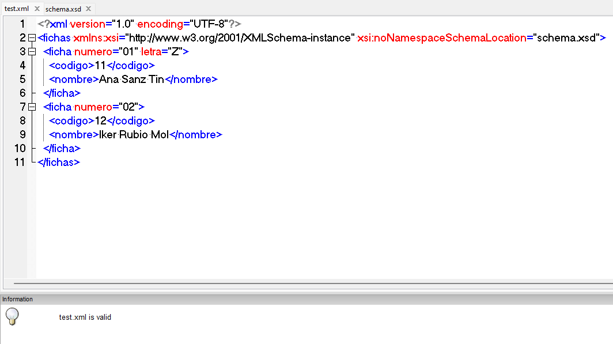

<style>
  h1{
    text-align: center;
    font-weight: bold;
    border: none;
    margin-bottom: 0px;
  }

  p{
    text-align: justify;
  }

  img{
    border: 2px solid black;
  }

  #ex{
    border: none;
  }
</style>

<h1>EXAMEN 2ª EVALUACIÓN</h1>

<hr>

<p><b>1. Dado el siguiente trozo de esquema realiza un fichero XML que sea capaz de validarlo:</b></p>

```xml
<xs:complexType name="alumno">
  <xs:secuence>
    <xs:element name="nombre" type="xs:string" minOccurs="1" maxOccurs="1"/>

    <xs:element name="apellidos" type="xs:string" minOccurs="1" maxOccurs="1"/>

    <xs:element name="web" type="xs:string" minOccurs="0" maxOccurs="5">
      <xs:complexType>
        <xs:attribute name="href" type="xs:string"/>
      </xs:complexType>
    </xs:element>
  <xs:secuence>
</xs:complexType>
```

<p>Respuesta:</p>

```xml
<!-- 1ª posibilidad -->

<alumno>
  <nombre>Pepe</nombre>
  <apellidos>García</apellidos>
  <web href="https://www.google.com">Google</web>
</alumno>
```


```xml
<!-- 2ª posibilidad -->

<alumno>
  <nombre>Pepe</nombre>
  <apellidos>García</apellidos>
</alumno>
```


```xml
<!-- 3ª posibilidad -->

<alumno>
  <nombre>Pepe</nombre>
  <apellidos>García</apellidos>
  <web href="https://www.google.com">Google</web>
  <web href="https://www.google.es">Google</web>
  <web href="https://www.example.com">Example</web>
  <web href="https://www.example2.com">Example2</web>
</alumno>
```


<p><b>2. Dado el siguiente fichero XML, realiza el esquema asociado y que lo valide:</b></p>

```xml
<xs:schema xmlns:xs="http://www.w3.org/2001/XMLSchema">
  <xs:element name="fichas">
    <xs:complexType>
      <xs:sequence>
        <xs:element name="ficha" maxOccurs="unbounded">
          <xs:complexType>
            <xs:simpleContent>
              <xs:extension base="xs:string">
                <xs:attribute name="numero" type="xs:string" use="required" />

                <xs:attribute name="letra" type="xs:string" use="optional" />
              </xs:extension>
            </xs:simpleContent>
            <xs:sequence>
              <xs:element name="codigo" type="xs:string" minOccurs="1" maxOccurs="1"/>

              <xs:element name="nombre" type="xs:string" minOccurs="1" maxOccurs="1"/>
            </xs:sequence>
          </xs:complexType>
        </xs:element>
      </xs:sequence>
    </xs:complexType>
  </xs:element>
</xs:schema>
```



<p><b>3. Ddo el siguiente fichero XML, realiza el schema. Para ello, sigue las instrucciones de las especificaciones:</b></p>

```xml
<?xml version="1.0" encoding="ISO-8859-1"?> 
<alumnos xmlns:xsi="http://www.w3.org/2001/XMLSchema-instance" xsi:SchemaLocation="file:/C:/Users/Ana_Desktop/alumnos.xsd"> 
 <alumno> 
  <nombre>Jose Ramón</nombre> 
  <apellidos>García González</apellidos> 
  <direccion> 
   <domicilio>El Pez, 12</domicilio> 
   <codigo_postal>85620</código_postal> 
   <localidad>Suances</localidad> 
   <provincia>Cantabria</provincia> 
  </direccion> 
  <contactar> 
   <telf._casa>985623165</telf._casa> 
   <telf._movil>611233544</telf._movil>
<telf._trabajo>965847536</telf._trabajo> 
   <email>pepito@educadistancia.com</email> 
  </contactar> 
  <aficiones> 
   <musica>Pop</musica> 
   <cine>Terror</cine> 
   <deporte> Futbol</deporte> 
  </aficiones> 
 </alumno> 
 <alumno> 
  <nombre>Carlos</nombre> 
  <apellidos>López Pérez</apellidos> 
  <direccion> 
   <domicilio>El Cangrejo, 25</domicilio> 
   <codigo_postal>86290</código_postal> 
   <localidad>Santillana</localidad> 
   <provincia>Cantabria</provincia> 
  </direccion> 
  <contactar> 
   <telf._casa>931132565</telf._casa> 
   <telf._movil>623863544</telf._movil> 
   <telf._trabajo>984657536</telf._trabajo> 
   <email>carlos@educadistancia.com</email> 
  </contactar> 
  <aficiones> 
   <musica>Rock</musica> 
   <cine>Comedia</cine> 
   <deporte> Judo</deporte> 
  </aficiones> 
 </alumno> 
</alumnos>
```

<p><b>a. Tipo de datosDireccion donde se ha de incluir un patrón para el código postal compuesto de 5 
números.</b></p>

```xml
<xs:simpleType name="TipoDatosDireccion">
  <xs:restriction base="xs:string">
    <xs:pattern value="[0-9]{5}"/>
  </xs:restriction>
</xs:simpleType>
```

<p><b>Tipo de datosContactar donde se ha poner un número de ocurrencias de número de teléfonos que habrá de ser un mínimo de 1 y un máximo de 5 ambos incluidos. Además, se ha de crear un patrón para el correo electrónico que incluya el carácter “@” y el dominio:".com"</b></p>

```xml
<xs:complexType name="tipoContactar">
  <xs:sequence>
    <xs:element name="telf._casa" type="xs:string" minOccurs="1" maxOccurs="5"/>
    <xs:element name="telf._movil" type="xs:string" minOccurs="0" maxOccurs="5"/>
    <xs:element name="telf._trabajo" type="xs:string" minOccurs="0" maxOccurs="5"/>
    <xs:element name="email" type="xs:string" pattern="[a-zA-Z0-9._%+-]+@[a-zA-Z0-9.-]+\.[a-zA-Z]{2,4}"/>
  </xs:sequence>
</xs:complexType>
```

<p><b>c. Tipo de datosAficiones que ha de contar con 3 enumeraciones con 4 valores que tú estipules para las respectivas categorías de música, cine y de deporte.</b></p>

```xml
<xs:simpleType name="TipoDatosAficiones">
  <xs:restriction base="xs:string">
    <xs:enumeration value="Pop"/>
    <xs:enumeration value="Rock"/>
    <xs:enumeration value="Clásica"/>
    <xs:enumeration value="Jazz"/>
    <xs:enumeration value="Terror"/>
    <xs:enumeration value="Comedia"/>
    <xs:enumeration value="Drama"/>
    <xs:enumeration value="Acción"/>
    <xs:enumeration value="Futbol"/>
    <xs:enumeration value="Baloncesto"/>
    <xs:enumeration value="Judo"/>
    <xs:enumeration value="Natación"/>
  </xs:restriction>
</xs:simpleType>
```