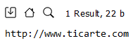

<style>
  h1, h4{
    text-align: center;
    font-weight: bold;
    border: none;
    margin-bottom: 0px;
  }

  p{
    text-align: justify;
  }

  img{
    border: 2px solid black;
  }

  #ex{
    border: none;
  }
</style>

<h1>RELACIÓN 1</h1>

<h4>CHRISTIAN MILLÁN SORIA</h4>

<hr>

<p><b>1. Dado el siguiente documento XML, realiza las siguientes consultas con XPATH:</b></p>

```xml
<?xml version="1.0" encoding="UTF-8"?>

<ies>
  <nombre>IES TicArte</nombre>

  <web>http://www.ticarte.com</web>

  <ciclos>
    <ciclo id="ASIR">
      <nombre>Administración de Sistemas Informáticos en Red</nombre>
      <grado>Superior</grado>
      <decretoTitulo anyo="2009"/>
    </ciclo>

    <ciclo id="DAW">
      <nombre>Desarrollo de Aplicaciones Web</nombre>
      <grado>Superior</grado>
      <decretoTitulo anyo="2010"/>
    </ciclo>

    <ciclo id="SMR">
      <nombre>Sistemas Microinformáticos y Redes</nombre>
      <grado>Medio</grado>
      <decretoTitulo anyo="2008"/>
    </ciclo>
  </ciclos>
</ies>
```

<li><b>Mostrar el nombre del instituto.</b></li>

```bash
/ies/nombre/text()
```


<li><b>Mostrar la página web del instituto sin etiquetas.</b></li>

```bash
/ies/web/text()
```



<li><b>Mostrar el nombre de los ciclos formativos sin etiquetas.</b></li>

```bash
//ciclo/nombre/text()
```


<li><b>Mostrar las siglas por las que se conocen los ciclos formativos.</b></li>

```bash
//ciclo/@id
```


<li><b>Mostrar los años en lso que se publicaron los decretos de los ciclos formativos.</b></li>

```bash
//ciclo/decretoTitulo/@anyo
```


<li><b>Mostrar toda la información de los ciclos formativos de grado medio.</b></li>

```bash
//ciclo[grado="Medio"]
```


<li><b>Mostrar los nombre de los ciclos formativos de grado superior.</b></li>

```bash
//ciclo[grado="Superior"]/nombre
```


<li><b>Mostrar los nombres de los ciclos formativos anteriores a 2010 sin etiquetas.</b></li>

```bash
//ciclo[decretoTitulo/@anyo<2010]/nombre/text()
```


<li><b>Mostrar los nombres de los ciclos formativos de 2008 o de 2010.</b></li>

```bash
//ciclo[decretoTitulo/@anyo=2008 or decretoTitulo/@anyo=2010]/nombre/text()
```


<p><b>2. Dado el siguiente documento XML, realiza las siguiente consultas con XPATH:</b></p>

```xml
<?xml version="1.0" encoding="UTF-8"?>

<ies>
  <modulos>
    <modulo id="0228">
      <nombre>Aplicaciones Web</nombre>
      <curso>2</curso>
      <horasSemanales>4</horasSemanales>
      <ciclo>SMR</ciclo>
    </modulo>

    <modulo id="0372">
      <nombre>Gestión de Bases de Datos</nombre>
      <curso>1</curso>
      <horasSemanales>5</horasSemanales>
      <ciclo>ASIR</ciclo>
    </modulo>

    <modulo id="0373">
      <nombre>Lenguajes de Marcas y Sistemas de Gestión de Información</nombre>
      <curso>1</curso>
      <horasSemanales>3</horasSemanales>
      <ciclo>DAW</ciclo>
    </modulo>

    <modulo id="0376">
      <nombre>Implantación de Aplicaciones Web</nombre>
      <curso>2</curso>
      <horasSemanales>5</horasSemanales>
      <ciclo>ASIR</ciclo>
    </modulo>
  </modulos>
</ies>
```

<li><b>Mostrar el nombre sin etiquetas de los módulos que se imparten en el instituto.</b></li>

```bash

```

