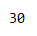

<style>
  h1, h4{
    text-align: center;
    font-weight: bold;
    border: none;
    margin-bottom: 0px;
  }

  p{
    text-align: justify;
  }

  img{
    border: 2px solid black;
  }

  #ex{
    border: none;
  }
</style>

<h1>RELACIÓN 2</h1>

<h4>CHRISTIAN MILLÁN SORIA</h4>

<hr>

<p><b>1. ¿Qué devuelve esta expresión? Pon un caso o dos de ejemplo que lo cumplan.</b></p>

```xquery
some $x in(1, 2, 3), $y in(2, 3, 4) satisfies $x+$y=4
```

<p>Esta expresión devuelve casos que cumplen la condición.</p>

<p>Algunos ejemplos pueden ser:</p>

<li>1+3</li>

<li>2+2</li>

<p><b>2. ¿Qué hace esta expresión? ¿Qué devuelve?</b></p>

```xquery
avg(for $x at $i in(1 to 1000) where $i mod 100=0 return $x)
```

<p>La expresión calcula la media aritmética de los valores de una secuencia. En este caso, la secuencia consiste en los valores de la variable $x para los cuales la variable $i toma valores en el rango de 1 a 1000 y $i es divisible por 100.</p>

<p>La expresión devuelve un valor numérico que es la media aritmética de los valores de la secuencia resultante.</p>

<p><b>Dado el siguiente XML...</b></p>

```xml
<actividades>
  <actividad id="1">
    <nombre>BodyPump</nombre>
    <precio cuota="quincenal" moneda="euro">14</precio>
    <plazas>5</plazas>
    <comienzo>13/04/2020</comienzo>
    <fin>27/04/2020</fin>
    <profesor>Ricardo Leal</profesor>
    <categoría>Cardio_fuerza</categoría>
    <nivel_dificultad>alta</nivel_dificultad>
    <sala>3</sala>
  </actividad>

  <actividad id="2">
    <nombre>Zumba</nombre>
    <precio cuota="semanal" moneda="euro">10</precio>
    <plazas>10</plazas>
    <comienzo>20/04/2020</comienzo>
    <fin>30/04/2020</fin>
    <profesor>María Pérez</profesor>
    <categoría>Cardio</categoría>
    <nivel_dificultad>media</nivel_dificultad>
    <sala>2</sala>
  </actividad>

  <actividad id="3">
    <nombre>Pilates</nombre>
    <precio cuota="mensual" moneda="euro">30</precio>
    <plazas>8</plazas>
    <comienzo>15/05/2020</comienzo>
    <fin>15/06/2020</fin>
    <profesor>David Ruiz</profesor>
    <categoría>Flexibilidad</categoría>
    <nivel_dificultad>baja</nivel_dificultad>
    <sala>1</sala>
  </actividad>
</actividades>
```

<p><b>3. Mostrar los nombres de los profesores eliminando los valores repetidos y acompañar cada nombre con todas las salas en las que da clase, ordnénalos por nombre descendente.</b></p>

```xquery
for $profesor in distinct-values(/actividades/actividad/profesor)
let $salas:=/actividades/actividad[profesor=$profesor]/sala
order by $profesor descending
return 
  <profesor nombre="{ $profesor }">
    { $salas }
  </profesor>
```


<p><b>4. Mostrar la media de los precios de todas las actividades cuando la cuota sea mensual.</b></p>

```xquery
let $actividades-mensuales:=/actividades/actividad[precio/@cuota='mensual']
return avg($actividades-mensuales/precio)
```



<p><b>5. Mostrar la suma de los precios de las actividades de la sala 1.</b></p>

```xquery

```


<p><b>6. Mostrar la suma de las plazas en total que oferta el profesor </b></p>