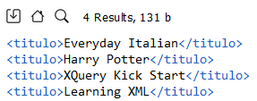

<style>
  h1, h2, h3, h4, h5, h6{
    text-align: center;
    font-weight: bold;
    border: none;
    margin-bottom: 0px;
  }

  p{
    text-align: justify;
  }

  img{
    border: 2px solid black;
  }
</style>

<h1>RELACIÓN 3</h1>

<h4>CHRISTIAN MILLÁN SORIA</h4>

<hr>

<p><b>1. Dado el siguiente documento XML, realiza las siguientes consultas con XQUERY:</b></p>

```xml
<?xml version="1.0" encoding="UTF-8"?>
<bookstore>
  <book category="COOKING">
    <title lang="en">Everyday Italian</title>
    <author>Giada De Laurentiis</author>
    <year>2005</year>
    <price>30.00</price>
  </book>

  <book category="CHILDREN">
    <title lang="en">Harry Potter</title>
    <author>J K. Rowling</author>
    <year>2005</year>
    <price>29.99</price>
  </book>

  <book category="WEB">
    <title lang="en">XQuery Kick Start</title>
    <author>James McGovern</author>
    <author>Per Bothner</author>
    <author>Kurt Cagle</author>
    <author>James Linn</author>
    <author>Vaidyanathan Nagarajan</author>
    <year>2003</year>
    <price>49.99</price>
  </book>

  <book category="WEB">
    <title lang="en">Learning XML</title>
    <author>Erik T. Ray</author>
    <year>2003</year>
    <price>39.95</price>
  </book>
</bookstore>
```

<p><b>a. Mostrar los títulos de los libros con la etiqueta "titulo".</b></p>

```xquery
for $titulo in /bookstore/book/title/text()
return <titulo>{$titulo}</titulo>
```



<p><b>b. Mostrar los libros cuyo precio sea menor o igual a 30. Primero incluyendo la condición en la cláusula "where" y luego en la ruta del XPATH.</b></p>

```xquery
for $libro in /bookstore/book
where $libro/price<=30
return $libro
```


```xquery
for $libro in /bookstore/book[price<=30]
return $libro
```


<p><b>c. Mostrar sólo el título de los libros cuyo precio sea menor o igual a 30.</b></p>

```xquery
for $book in //book[price<=30]
return $book/title
```


<p><b>d. Mostrar sólo el título sin atributos de los libros cuyo precio sea menor o igual a 30.</b></p>

```xquery
for $book in //book[price<=30]
return <title>{data($book/title)}</title>
```


<p><b>e. Mostrar el título y el autor de los libros del año 2005 y etiquetar cada uno de ellos con "lib2005".</b></p>

```xquery
for $book in //book[year=2005]
return <lib2005>
         {$book/title}
         {$book/author}
       </lib2005>
```


<p><b>f. Mostrar los años de publicación, primero con "for" y luego con "let" para comprobar la diferencia entre ellos. Etiquetar la salida con "publicacion".</b></p>

```xquery
<publicacion>
{
  for $book in //book
  return <year>{$book/year}</year>
}
</publicacion>
```


```xquery
<publicacion>
{
  let $years:=//book/year
  for $year in $years
  return <year>{$year}</year>
}
</publicacion>
```


<p><b>g. Mostrar los libros ordenados primero por "category" y luego por "title" en una sola consulta.</b></p>

```xquery
for $book in bookstore/book
order by $book/@category, $book/title
return $book
```


<p><b>h. Mostrar cuántos libros hay y etiquetarlo con "total".</b></p>

```xquery
<total>{count(//book)}</total>
```


<p><b>i. Mostrar los títulos de los libros y al final una etiqueta con el número total de libros.</b></p>

```xquery
<resultado>
{
  for $book in //book
  return <titulo>{$book/title/text()}</titulo>
}
<total_libros>{count(//book)}</total_libros>
</resultado>
```


<p><b>j. Mostrar el precio mínimo y máximo de los libros.</b></p>

```xquery
<resultado>
  <max>{max(//price)}</max>
  <min>{min(//price)}</min>
</resultado>
```


<p><b>k. Mostrar el título del libro, su precio y su precio con el IVA incluido, cada uno con su propia etiqueta. Ordénalos por precio con IVA.</b></p>

```xquery
<libros>
{
  for $book in //book
  let $price:=$book/price
  let $price_iva:=$price*1.21
  order by $price_iva ascending
  return <libro>
          <titulo>{$book/title/text()}</titulo>
          <precio>{$price} €</precio>
          <precio_iva>{$price_iva} €</precio_iva>
         </libro>
}
</libros>
```


<p><b>l. Mostrar la suma total de los precios de los libros con la etiqueta "total".</b></p>

```xquery
<total>{sum(/bookstore/book/price)}</total>
```


<p><b>m. Mostrar cada uno de los precios de los libros, y al final una nueva etiqueta con la sima de los precios.</b></p>

```xquery
<libros>
{
  for $p in //book/price
  return <price>{string($p)}</price>
}
<total>{sum(//book/price)}</total>
</libros>
```


<p><b>n. Mostrar el título y el número de autores que tiene cada título en etiquetas diferentes.</b></p>

```xquery
for $book in //book
return
  <libro>
    <title>{$book/title}</title>
    <autores>{count($book/author)}</autores>
  </libro>
```


<p><b>ñ. Mostrar en la misma etiqueta el título y entre paréntesis el número de autores que tiene ese título.</b></p>

```xquery
for $book in //book
return <libro>{$book/title/text()}({count($book/author)})</libro>
```


<p><b>o. Mostrar los libros escritos en años que terminen en "3".</b></p>

```xquery
for $book in //book
where substring($book/year, string-length($book/year))='3'
return $book
```


<p><b>p. Mostrar los libros cuya categoría empiece por "C".</b></p>

```xquery
for $book in //book[starts-with(@category, 'C')]
return $book
```


<p><b>q. Mostrar los libros que tengan una "X" mayúscula o minúscula en el título ordenados de manera descendente.</b></p>

```xquery
for $book in bookstore/book[contains(title, 'X') or contains(title, 'x')]
order by $book/title descending
return $book
```


<p><b>r. Mostrar el título y el número de caracteres que tiene cada título, cada uno con su propia etiqueta.</b></p>

```xquery
for $book in //book
return
<libro>
  <title lang="en">{data($book/title)}</title>
  <length>{string-length(data($book/title))}</length>
</libro>
```


<p><b>s. Mostrar todos los años en los que se ha publicado un libro eliminando los repetidos. Etiquétalos con "año".</b></p>

```xquery
distinct-values(//book/year)!<año>{.}</año>
```


<p><b>t. Mostrar todos los autores eliminando los que se repiten y ordenados por el número de caracteres que tiene cada autor.</b></p>

```xquery
for $author in distinct-values(//book/author)
order by string-length($author)
return <autor>{$author}</autor>
```


<p><b>u. Mostrar los títulos en una tabla de HTML.</b></p>

```xquery
<table>
{
for $book in //book
return <tr><td>{data($book/title)}</td></tr>
}
</table>
```

