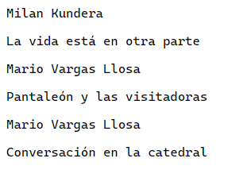

<style>
  h1, h2, h3, h4, h5, h6{
    text-align: center;
    font-weight: bold;
    border: none;
    margin-bottom: 0px;
  }

  p{
    text-align: justify;
  }

  img{
    border: 2px solid black;
  }
</style>

<h1>RELACIÓN 1</h1>

<h4>CHRISTIAN MILLÁN SORIA</h4>

<h4>1º DAW TARDE</h4>

<hr>

<p><b>Dado el siguiente XML:</b></p>

```xml
<?xml version="1.0" encoding="UTF-8"?>
<biblioteca>
  <libro>
    <titulo>La vida está en otra parte</titulo>
    <autor>Milan Kundera</autor>
    <fechaPublicacion año="1973"/>
  </libro>

  <libro>
    <titulo>Pantaleón y las visitadoras</titulo>
    <autor fechaNacimiento="28/03/1936">Mario Vargas Llosa</autor>
    <fechaPublicacion año="1973"/>
  </libro>

  <libro>
    <titulo>Conversación en la catedral</titulo>
    <autor fechaNacimiento="28/03/1936">Mario Vargas Llosa</autor>
    <fechaPublicacion año="1969"/>
  </libro>
</biblioteca>
```

<p><b>Prueba a ver qué resultado obtienes con los siguientes ejemplos de XSL:</b></p>

<p><b>1.</b></p>

```xsl
<?xml version="1.0" encoding="UTF-8"?>
<xsl:stylesheet xmlns:xsl="http://www.w3.org/1999/XSL/Transform" version="1.0">
  <xsl:output method="xml" indent="yes"/>

  <xsl:template match="/">
  </xsl:template>
</xsl:stylesheet>
```

```xsl
<?xml-stylesheet type="text/xsl" href="file:/C:/Users/chris/Documents/DAW/lenguajes_de_marcas/tema8/relacion1/extra/ejemplo1.xsl"?>
```


<p><b>2.</b></p>

```xsl
<?xml version="1.0" encoding="UTF-8"?>
<xsl:stylesheet xmlns:xsl="http://www.w3.org/1999/XSL/Transform" version="1.0">
  <xsl:output method="xml" indent="yes"/>

  <xsl:template match="/">
    ESTE TEXTO SE MUESTRA.
  </xsl:template>
</xsl:stylesheet>
```

```xsl
<?xml-stylesheet type="text/xsl" href="file:/C:/Users/chris/Documents/DAW/lenguajes_de_marcas/tema8/relacion1/extra/ejemplo2.xsl"?>
```


<p><b>3.</b></p>

```xsl
<?xml version="1.0" encoding="UTF-8"?>
<xsl:stylesheet xmlns:xsl="http://www.w3.org/1999/XSL/Transform" version="1.0">
  <xsl:output method="xml" indent="yes"/>

  <xsl:template match="/">
    ESTE TEXTO SE MUESTRA.
  </xsl:template>

  <xsl:template match="titulo">
    ¿ESTE TEXTO SE MUESTRA?
  </xsl:template>
</xsl:stylesheet>
```

```xsl
<?xml-stylesheet type="text/xsl" href="file:/C:/Users/chris/Documents/DAW/lenguajes_de_marcas/tema8/relacion1/extra/ejemplo3.xsl"?>
```


<p>Este no me funciona.</p>

<p><b>4.</b></p>

```xsl
<?xml version="1.0" encoding="UTF-8"?>
<xsl:stylesheet xmlns:xsl="http://www.w3.org/1999/XSL/Transform" version="1.0">
  <xsl:template match="libro">
    <xsl:value-of select="autor"/>
  </xsl:template>
</xsl:stylesheet>
```

```xsl
<?xml-stylesheet type="text/xsl" href="file:/C:/Users/chris/Documents/DAW/lenguajes_de_marcas/tema8/relacion1/extra/ejemplo4.xsl"?>
```


<p><b>5.</b></p>

```xsl
<?xml version="1.0" encoding="UTF-8"?>
<xsl:stylesheet xmlns:xsl="http://www.w3.org/1999/XSL/Transform" version="1.0">
  <xsl:template match="libro">
    <xsl:value-of select="titulo"/>

    <xsl:value-of select="autor"/>
  </xsl:template>
</xsl:stylesheet>
```

```xsl
<?xml-stylesheet type="text/xsl" href="file:/C:/Users/chris/Documents/DAW/lenguajes_de_marcas/tema8/relacion1/extra/ejemplo5.xsl"?>
```


<p><b>6.</b></p>

```xsl
<?xml version="1.0" encoding="UTF-8"?>
<xsl:stylesheet xmlns:xsl="http://www.w3.org/1999/XSL/Transform" version="1.0">
  <xsl:template match="fechaPublicacion">
    <xsl:value-of select="@año"/>
  </xsl:template>
</xsl:stylesheet>
```

```xsl
<?xml-stylesheet type="text/xsl" href="file:/C:/Users/chris/Documents/DAW/lenguajes_de_marcas/tema8/relacion1/extra/ejemplo6.xsl"?>
```


<p><b>7.</b></p>

```xsl
<?xml version="1.0" encoding="UTF-8"?>
<xsl:stylesheet xmlns:xsl="http://www.w3.org/1999/XSL/Transform" version="1.0">
  <xsl:template match="libro">
    <p><xsl:value-of select="autor"/></p>

    <p><xsl:value-of select="titulo"/></p>
  </xsl:template>
</xsl:stylesheet>
```

```xsl
<?xml-stylesheet type="text/xsl" href="file:/C:/Users/chris/Documents/DAW/lenguajes_de_marcas/tema8/relacion1/extra/ejemplo7.xsl"?>
```



<p><b>8.</b></p>

```xsl
<?xml version="1.0" encoding="UTF-8"?>
<xsl:stylesheet xmlns:xsl="http://www.w3.org/1999/XSL/Transform" version="1.0">
  <xsl:template match="libro">
    <p><xsl:value-of select="autor"/> escribió "<xsl:value-of select="titulo"/>"</p>
  </xsl:template>
</xsl:stylesheet>
```

```xsl
<?xml-stylesheet type="text/xsl" href="file:/C:/Users/chris/Documents/DAW/lenguajes_de_marcas/tema8/relacion1/extra/ejemplo8.xsl"?>
```


<p><b>9.</b></p>

```xsl
<?xml version="1.0" encoding="UTF-8"?>
<xsl:stylesheet xmlns:xsl="http://www.w3.org/1999/XSL/Transform" version="1.0">
  <xsl:template match="/">
    <html>
      <h1>Autores</h1>

      <xsl:apply-templates/>
    </html>
  </xsl:template>

  <xsl:template match="libro">
    <p><xsl:value-of select="autor"/></p>
  </xsl:template>
</xsl:stylesheet>
```

```xsl
<?xml-stylesheet type="text/xsl" href="file:/C:/Users/chris/Documents/DAW/lenguajes_de_marcas/tema8/relacion1/extra/ejemplo9.xsl"?>
```

