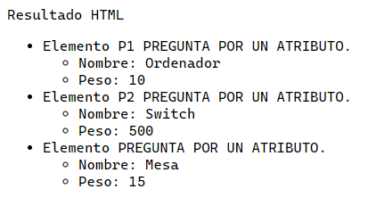
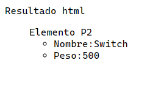
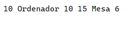
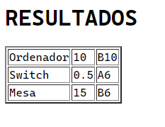
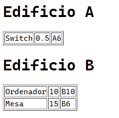

<style>
  h1, h2, h3, h4, h5, h6{
    text-align: center;
    font-weight: bold;
    border: none;
    margin-bottom: 0px;
  }

  p{
    text-align: justify;
  }

  img{
    border: 2px solid black;
  }
</style>

<h1>RELACIÓN 2</h1>

<h4>CHRISTIAN MILLÁN SORIA</h4>

<h4>1º DAW TARDE</h4>

<hr>

<p><b>Dado el siguiente XML:</b></p>

```xml
<?xml version="1.0" encoding="UTF-8"?>
<?xml-stylesheet type="text/xsl" href="ejercicio1_1.xsl"?>
<inventario>
  <producto codigo="P1">
    <peso unidad="kg">10</peso>
    <nombre>Ordenador</nombre>
    <lugar edificio="B">
    <aula>10</aula>
    </lugar>
  </producto>

  <producto codigo="P2">
    <peso unidad='g'>500</peso>
    <nombre>Switch</nombre>
    <lugar edificio="A">
    <aula>6</aula>
    </lugar>
  </producto>

  <producto>
    <peso unidad='kg'>15</peso>
    <nombre>Mesa</nombre>
    <lugar edificio="B">
    <aula>6</aula>
    </lugar>
  </producto>
</inventario>
```

<p><b>1.</b></p>

```xsl
<?xml version="1.0" encoding="UTF-8"?>
<xsl:stylesheet xmlns:xsl="http://www.w3.org/1999/XSL/Transform" xmlns:xs="http://www.w3.org/2001/XMLSchema" exclude-result-prefixes="xs" version="2.0">
  <xsl:template match="/">
    <html>
      <head>Resultado HTML</head>
        <body>
        <ul>
        <xsl:for-each select="inventario/producto">
        <li>
        Elemento
        <xsl:value-of select="@codigo"/> PREGUNTA POR UN ATRIBUTO.
        <ul>
        <li>
        Nombre: <xsl:value-of select="nombre"/>
        </li>
        <li>
        Peso: <xsl:value-of select="peso"/>
        </li>
        </ul>
        </li>
        </xsl:for-each>
        </ul>
      </body>
    </html>
  </xsl:template>
</xsl:stylesheet>
```

```xsl
<?xml-stylesheet type="text/xsl" href="file:/C:/Users/chris/Documents/DAW/lenguajes_de_marcas/tema8/relacion2/extra/ejemplo1.xsl"?>
```



<p><b>2.</b></p>

```xsl
<?xml version="1.0" encoding="UTF-8"?>
<xsl:stylesheet xmlns:xsl="http://www.w3.org/1999/XSL/Transform" xmlns:xs="http://www.w3.org/2001/XMLSchema" exclude-result-prefixes="xs" version="2.0">
  <xsl:template match="/">
    <html>
      <head>Resultado html</head>
      <body>
      <ul>
      <xsl:for-each select="/inventario/producto[lugar/@edificio='A' and lugar/aula=6]">
      Elemento
      <xsl:value-of select="@codigo"/>
      <ul>
      <li>
      Nombre:<xsl:value-of select="nombre"/>
      </li>
      <li>
      Peso:<xsl:value-of select="peso"/>
      </li>
      </ul>
      </xsl:for-each>
      </ul>
      </body>
    </html>
  </xsl:template>
</xsl:stylesheet>
```

```xsl
<?xml-stylesheet type="text/xsl" href="file:/C:/Users/chris/Documents/DAW/lenguajes_de_marcas/tema8/relacion2/extra/ejemplo2.xsl"?>
```



<p><b>3.</b></p>

```xsl
<?xml version="1.0" encoding="UTF-8"?>
<xsl:stylesheet xmlns:xsl="http://www.w3.org/1999/XSL/Transform" xmlns:xs="http://www.w3.org/2001/XMLSchema" exclude-result-prefixes="xs" version="2.0">
  <xsl:template match="/">
    <inventario>
      <xsl:for-each select="inventario/producto">
        <xsl:if test="lugar/@edificio='B' ">
          <producto>
            <peso>
              <xsl:atribute name="unidad">
                <xsl:value-of select="peso/@unidad">
                </xsl:value-of>
              </xsl:atribute>
              <xsl:value-of select="peso"/>
            </peso>

            <nombre>
              <xsl:value-of select="nombre"/>
            </nombre>

            <lugar>
              <xsl:atribute name="edificio">
                <xsl:value-of select="lugar/@edificio"></xsl:value-of>
              </xsl:atribute>
              <aula>
                <xsl:value-of select="lugar/aula"/>
              </aula>
            </lugar>
          </producto>
        </xsl:if>
      </xsl:for-each>
    </inventario>
  </xsl:template>
</xsl:stylesheet>
```

```xsl
<?xml-stylesheet type="text/xsl" href="file:/C:/Users/chris/Documents/DAW/lenguajes_de_marcas/tema8/relacion2/extra/ejemplo3.xsl"?>
```



<p><b>4.</b></p>

```xsl
<?xml version="1.0" encoding="UTF-8"?>
<xsl:stylesheet xmlns:xsl="http://www.w3.org/1999/XSL/Transform" xmlns:xs="http://www.w3.org/2001/XMLSchema" exclude-result-prefixes="xs" version="2.0">
  <xsl:template match="/">
    <html>
      <head>
        <h1>RESULTADOS</h1>
      </head>

      <body>
        <table border="2">
          <xsl:for-each select="/inventario/producto">
            <tr>
              <td><xsl:value-of select="nombre"/></td>

              <td>
                <xsl:choose>
                  <xsl:when test="peso/@unidad='kg'">
                    <xsl:value-of select="peso"/>
                  </xsl:when>

                  <xsl:otherwise>
                    <xsl:value-of select="peso div 1000"></xsl:value-of>
                  </xsl:otherwise>
                </xsl:choose>
              </td>

              <xsl:variable name="aula" select="lugar/aula"/>

              <td><xsl:value-of select="concat(lugar/@edificio,$aula)"/></td>
            </tr>
          </xsl:for-each>
        </table>
      </body>
    </html>
```

```xsl
<?xml-stylesheet type="text/xsl" href="file:/C:/Users/chris/Documents/DAW/lenguajes_de_marcas/tema8/relacion2/extra/ejemplo4.xsl"?>
```



<p><b>5.</b></p>

```xsl
<?xml version="1.0" encoding="UTF-8"?>
<xsl:stylesheet xmlns:xsl="http://www.w3.org/1999/XSL/Transform" xmlns:xs="http://www.w3.org/2001/XMLSchema" exclude-result-prefixes="xs" version="2.0">
  <xsl:template match="/">
    <html>
      <head><title>Resultado</title></head>
      <body>
      <h1>Edificio A</h1>
      <table border='1'>
      <xsl:for-each select="inventario/producto">
      <xsl:if test="lugar/@edificio='A'">
      <tr>
      <td><xsl:value-of select="nombre"/> </td>
      <td><xsl:choose>
      <xsl:when test="peso/@unidad= 'kg'">
      <xsl:value-of select="peso"/>
      </xsl:when>
      <xsl:otherwise>
      <xsl:value-of select="peso div 1000"></xsl:value-of>
      </xsl:otherwise>
      </xsl:choose></td>
      <td><xsl:value-of select="lugar/@edificio"/>
      <xsl:value-of select="lugar/aula"/></td>
      </tr>
      </xsl:if>
      </xsl:for-each>
      </table>
      <h1>Edificio B</h1>
      <table border='1'>
      <xsl:for-each select="inventario/producto">
      <xsl:if test="lugar/@edificio='B'">
      <tr>
      <td><xsl:value-of select="nombre"/></td>
      <td><xsl:value-of select="peso"/></td>
      <td><xsl:value-of select="lugar/@edificio"/>
      <xsl:value-of select="lugar/aula"/></td>
      </tr>
      </xsl:if>
      </xsl:for-each>
      </table>
      </body>
    </html>
  </xsl:template>
</xsl:stylesheet>
```

```xsl
<?xml-stylesheet type="text/xsl" href="file:/C:/Users/chris/Documents/DAW/lenguajes_de_marcas/tema8/relacion2/extra/ejemplo5.xsl"?>
```

