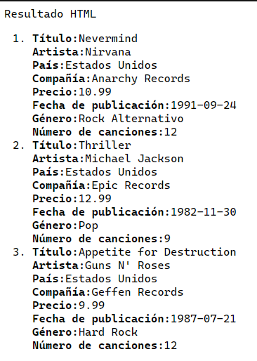
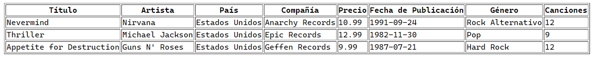
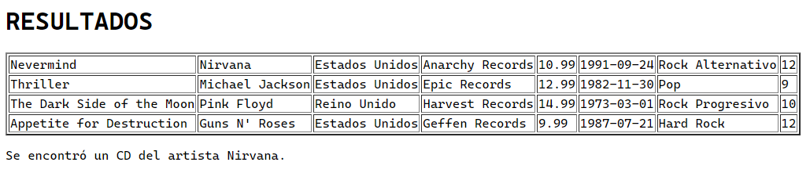

<style>
  h1, h2, h3, h4, h5, h6{
    text-align: center;
    font-weight: bold;
    border: none;
    margin-bottom: 0px;
  }

  p{
    text-align: justify;
  }

  img{
    border: 2px solid black;
  }
</style>

<h1>RELACIÓN 3</h1>

<h4>CHRISTIAN MILLÁN SORIA</h4>

<h4>1º DAW TARDE</h4>

<hr>

<p><b>Partiendo del fichero XML de CDs realizado en la práctica de XML y CSS, realiza las siguientes actividades</b></p>

<p>XML:</p>

```xml
<?xml version="1.0" encoding="UTF-8"?>
<?xml-stylesheet type="text/css" href="file:/C:\Users\chris\Documents\DAW\lenguajes_de_marcas\tema8\relacion3\extra\ej2.xsl"?>
<catalogo>
  <cd id="1">
    <titulo atributo="valor">Nevermind</titulo>
    <artista origen="EEUU">Nirvana</artista>
    <pais codigo="US">Estados Unidos</pais>
    <compania>Anarchy Records</compania>
    <precio moneda="USD">10.99</precio>
    <fecha_publicacion formato="YYYY-MM-DD">1991-09-24</fecha_publicacion>
    <genero>Rock Alternativo</genero>
    <canciones total="12">12</canciones>
  </cd>

  <cd id="2">
    <titulo atributo="valor">Thriller</titulo>
    <artista origen="EEUU">Michael Jackson</artista>
    <pais codigo="US">Estados Unidos</pais>
    <compania>Epic Records</compania>
    <precio moneda="USD">12.99</precio>
    <fecha_publicacion formato="YYYY-MM-DD">1982-11-30</fecha_publicacion>
    <genero>Pop</genero>
    <canciones total="9">9</canciones>
  </cd>

  <cd id="3">
    <titulo atributo="valor">The Dark Side of the Moon</titulo>
    <artista origen="Reino Unido">Pink Floyd</artista>
    <pais codigo="UK">Reino Unido</pais>
    <compania>Harvest Records</compania>
    <precio moneda="USD">14.99</precio>
    <fecha_publicacion formato="YYYY-MM-DD">1973-03-01</fecha_publicacion>
    <genero>Rock Progresivo</genero>
    <canciones total="10">10</canciones>
  </cd>

  <cd id="4">
    <titulo atributo="valor">Appetite for Destruction</titulo>
    <artista origen="EEUU">Guns N' Roses</artista>
    <pais codigo="US">Estados Unidos</pais>
    <compania>Geffen Records</compania>
    <precio moneda="USD">9.99</precio>
    <fecha_publicacion formato="YYYY-MM-DD">1987-07-21</fecha_publicacion>
    <genero>Hard Rock</genero>
    <canciones total="12">12</canciones>
  </cd>
</catalogo>
```

<p><b>1. Consigue un documento HTML donde se visualice una lista de elementos ordenados y donde se seleccione información de elementos, pero donde también se haya filtrado por algún atributo de tu fichero XML (si no lo tienes, modifica el fichero XML para que lo tenga).</b></p>

<p>XSLT:</p>

```xslt
<?xml version="1.0" encoding="UTF-8"?>
<xsl:stylesheet xmlns:xsl="http://www.w3.org/1999/XSL/Transform" version="2.0">
  <xsl:template match="/">
    <html>
      <head>Resultado HTML</head>
      <body>
        <ol>
          <xsl:for-each select="/catalogo/cd[pais='Estados Unidos']">
            <li>
              <strong>Título:</strong> <xsl:value-of select="titulo"/><br/>
              <strong>Artista:</strong> <xsl:value-of select="artista"/><br/>
              <strong>País:</strong> <xsl:value-of select="pais"/><br/>
              <strong>Compañía:</strong> <xsl:value-of select="compania"/><br/>
              <strong>Precio:</strong> <xsl:value-of select="precio"/><br/>
              <strong>Fecha de publicación:</strong> <xsl:value-of select="fecha_publicacion"/><br/>
              <strong>Género:</strong> <xsl:value-of select="genero"/><br/>
              <strong>Número de canciones:</strong> <xsl:value-of select="canciones"/><br/>
            </li>
          </xsl:for-each>
        </ol>
      </body>
    </html>
  </xsl:template>
</xsl:stylesheet>
```

<p>HTML:</p>

```html
<?xml version="1.0" encoding="UTF-8"?>
<html>
  <head>Resultado HTML</head>
  <body>
    <ol>
      <li><strong>Título:</strong>Nevermind<br/><strong>Artista:</strong>Nirvana<br/><strong>País:</strong>Estados Unidos<br/><strong>Compañía:</strong>Anarchy Records<br/><strong>Precio:</strong>10.99<br/><strong>Fecha de publicación:</strong>1991-09-24<br/><strong>Género:</strong>Rock Alternativo<br/><strong>Número de canciones:</strong>12<br/></li>
      <li><strong>Título:</strong>Thriller<br/><strong>Artista:</strong>Michael Jackson<br/><strong>País:</strong>Estados Unidos<br/><strong>Compañía:</strong>Epic Records<br/><strong>Precio:</strong>12.99<br/><strong>Fecha de publicación:</strong>1982-11-30<br/><strong>Género:</strong>Pop<br/><strong>Número de canciones:</strong>9<br/></li>
      <li><strong>Título:</strong>Appetite for Destruction<br/><strong>Artista:</strong>Guns N' Roses<br/><strong>País:</strong>Estados Unidos<br/><strong>Compañía:</strong>Geffen Records<br/><strong>Precio:</strong>9.99<br/><strong>Fecha de publicación:</strong>1987-07-21<br/><strong>Género:</strong>Hard Rock<br/><strong>Número de canciones:</strong>12<br/></li>
    </ol>
  </body>
</html>
```



<p><b>2. Consigue un documento HTML donde se visualice una tabla y donde uses una sentencia "if" preguntando por un elemento o por un atributo.</b></p>

<p>XSLT:</p>

```xslt
<?xml version="1.0" encoding="UTF-8"?>
<xsl:stylesheet xmlns:xsl="http://www.w3.org/1999/XSL/Transform" version="2.0">
  <xsl:template match="/">
    <html>
      <head>
        <title>Resultado</title>
      </head>
      <body>
        <table border="1">
          <tr>
            <th>Título</th>
            <th>Artista</th>
            <th>País</th>
            <th>Compañía</th>
            <th>Precio</th>
            <th>Fecha de Publicación</th>
            <th>Género</th>
            <th>Canciones</th>
          </tr>
          <xsl:for-each select="catalogo/cd">
            <xsl:if test="pais = 'Estados Unidos'">
              <tr>
                <td><xsl:value-of select="titulo"/></td>
                <td><xsl:value-of select="artista"/></td>
                <td><xsl:value-of select="pais"/></td>
                <td><xsl:value-of select="compania"/></td>
                <td><xsl:value-of select="precio"/></td>
                <td><xsl:value-of select="fecha_publicacion"/></td>
                <td><xsl:value-of select="genero"/></td>
                <td><xsl:value-of select="canciones"/></td>
              </tr>
            </xsl:if>
          </xsl:for-each>
        </table>
      </body>
    </html>
  </xsl:template>
</xsl:stylesheet>
```

<p>HTML:</p>

```html
<?xml version="1.0" encoding="UTF-8"?>
<html>
  <head>
    <title>Resultado</title>
  </head>
  <body>
    <table border="1">
      <tr>
        <th>Título</th>
        <th>Artista</th>
        <th>País</th>
        <th>Compañía</th>
        <th>Precio</th>
        <th>Fecha de Publicación</th>
        <th>Género</th>
        <th>Canciones</th>
      </tr>
      <tr>
        <td>Nevermind</td>
        <td>Nirvana</td>
        <td>Estados Unidos</td>
        <td>Anarchy Records</td>
        <td>10.99</td>
        <td>1991-09-24</td>
        <td>Rock Alternativo</td>
        <td>12</td>
      </tr>
      <tr>
        <td>Thriller</td>
        <td>Michael Jackson</td>
        <td>Estados Unidos</td>
        <td>Epic Records</td>
        <td>12.99</td>
        <td>1982-11-30</td>
        <td>Pop</td>
        <td>9</td>
      </tr>
      <tr>
        <td>Appetite for Destruction</td>
        <td>Guns N' Roses</td>
        <td>Estados Unidos</td>
        <td>Geffen Records</td>
        <td>9.99</td>
        <td>1987-07-21</td>
        <td>Hard Rock</td>
        <td>12</td>
      </tr>
    </table>
  </body>
</html>
```



<p><b>3. Consigue un documento HTML donde se visualice una tabla y donde uses una sentencia "choose" preguntando por un elemento o por un atributo.</b></p>

<p>XSLT:</p>

```xslt
<?xml version="1.0" encoding="UTF-8"?>
<xsl:stylesheet xmlns:xsl="http://www.w3.org/1999/XSL/Transform" version="2.0">
  <xsl:template match="/">
    <html>
      <head>
        <h1>RESULTADOS</h1>
      </head>
      <body>
        <table border="2">
          <xsl:for-each select="/catalogo/cd">
            <tr>
              <td><xsl:value-of select="titulo"/></td>
              <td><xsl:value-of select="artista"/></td>
              <td><xsl:value-of select="pais"/></td>
              <td><xsl:value-of select="compania"/></td>
              <td><xsl:value-of select="precio"/></td>
              <td><xsl:value-of select="fecha_publicacion"/></td>
              <td><xsl:value-of select="genero"/></td>
              <td><xsl:value-of select="canciones"/></td>
            </tr>
          </xsl:for-each>
        </table>
        <xsl:choose>
          <xsl:when test="/catalogo/cd/artista='Nirvana'">
            <p>Se encontró un CD del artista Nirvana.</p>
          </xsl:when>
          <xsl:otherwise>
            <p>No se encontró ningún CD del artista Nirvana.</p>
          </xsl:otherwise>
        </xsl:choose>
      </body>
    </html>
  </xsl:template>
</xsl:stylesheet>
```

<p>HTML:</p>

```html
<?xml version="1.0" encoding="UTF-8"?>
<html>
  <head>
    <h1>RESULTADOS</h1>
  </head>
  <body>
    <table border="2">
      <tr>
        <td>Nevermind</td>
        <td>Nirvana</td>
        <td>Estados Unidos</td>
        <td>Anarchy Records</td>
        <td>10.99</td>
        <td>1991-09-24</td>
        <td>Rock Alternativo</td>
        <td>12</td>
      </tr>
      <tr>
        <td>Thriller</td>
        <td>Michael Jackson</td>
        <td>Estados Unidos</td>
        <td>Epic Records</td>
        <td>12.99</td>
        <td>1982-11-30</td>
        <td>Pop</td>
        <td>9</td>
      </tr>
      <tr>
        <td>The Dark Side of the Moon</td>
        <td>Pink Floyd</td>
        <td>Reino Unido</td>
        <td>Harvest Records</td>
        <td>14.99</td>
        <td>1973-03-01</td>
        <td>Rock Progresivo</td>
        <td>10</td>
      </tr>
      <tr>
        <td>Appetite for Destruction</td>
        <td>Guns N' Roses</td>
        <td>Estados Unidos</td>
        <td>Geffen Records</td>
        <td>9.99</td>
        <td>1987-07-21</td>
        <td>Hard Rock</td>
        <td>12</td>
      </tr>
    </table>
    <p>Se encontró un CD del artista Nirvana.</p>
  </body>
</html>
```

