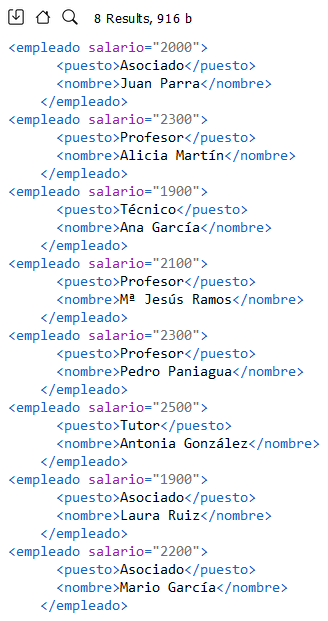
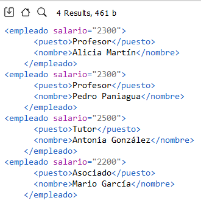
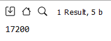
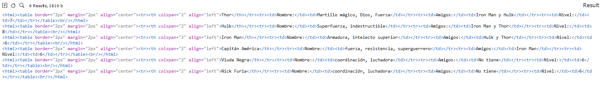
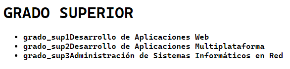

<style>
  h1, h2, h3, h4, h5, h6{
    text-align: center;
    font-weight: bold;
    border: none;
    margin-bottom: 0px;
  }

  p{
    text-align: justify;
  }

  img{
    border: 2px solid black;
  }
</style>

<h1>EXAMEN LENGUAJES DE MARCAS</h1>

<h4>CHRISTIAN MILLÁN SORIA</h4>

<h4>1º DAW TARDE</h4>

<hr>

<p><b>1. Ejercicio de XPATH. Partimos del fichero "Universidad.xml":</b></p>

```xml
<universidad>
  <departamento telefono="112233" tipo="A">
    <codigo>IFC1</codigo>
    <nombre>Informática</nombre>
    <empleado salario="2000">
      <puesto>Asociado</puesto>
      <nombre>Juan Parra</nombre>
    </empleado>
    <empleado salario="2300">
      <puesto>Profesor</puesto>
      <nombre>Alicia Martín</nombre>
    </empleado>
  </departamento>
  <departamento telefono="990033" tipo="A">
    <codigo>MAT1</codigo>
    <nombre>Matemáticas</nombre>
    <empleado salario="1900">
      <puesto>Técnico</puesto>
      <nombre>Ana García</nombre>
    </empleado>
    <empleado salario="2100">
      <puesto>Profesor</puesto>
      <nombre>Mª Jesús Ramos</nombre>
    </empleado>
    <empleado salario="2300">
      <puesto>Profesor</puesto>
      <nombre>Pedro Paniagua</nombre>
    </empleado>
    <empleado salario="2500">
      <puesto>Tutor</puesto>
      <nombre>Antonia González</nombre>
    </empleado>
  </departamento>
  <departamento telefono="880833" tipo="B">
    <codigo>MAT2</codigo>
    <nombre>Análisis</nombre>
    <empleado salario="1900">
      <puesto>Asociado</puesto>
      <nombre>Laura Ruiz</nombre>
    </empleado>
    <empleado salario="2200">
      <puesto>Asociado</puesto>
      <nombre>Mario García</nombre>
    </empleado>
  </departamento>
</universidad>
```

<p><b>Realiza las siguientes cuestiones usando XPATH y especifica la ruta y el resultado obtenido para calcular las siguientes cuestiones:</b></p>

<p><b>1. Los datos con etiquetas de los empleados que tengan el atributo salario.</b></p>

```xpath
/universidad/departamento/empleado[@salario]
```



<p><b>2. Los datos, y solo los datos, sin etiquetas, de los departamentos cuyo teléfono sea 990033.</b></p>

```xpath
/universidad/departamento[@telefono='990033']//text()
```


<p><b>3. Los datos con etiquetas de los empleados cuyo salario sea mayor de 2100.</b></p>

```xpath
/universidad/departamento/empleado[@salario>2100]
```



<p><b>4. Devuelve la suma total del salario de todos los empleados.</b></p>

```xpath
sum(//empleado/@salario)
```



<p><b>2. Ejercicio de XQUERY. Dado el siguiente fichero XML llamado "ejercicio2.xml":</b></p>

```xml
<?xml version="1.0" encoding="UTF-8"?>
<marvel>
  <superheroe nombre="Thor" poderes="Martillo mágico, Dios, Fuerza" amigos="Iron Man y Hulk" nivel="7"/>
  <superheroe nombre="Hulk" poderes="Superfuerza, indestructible" amigos="Iron Man y Thor" nivel="8"/>
  <superheroe nombre="Iron Man" poderes="Armadura, intelecto superior" amigos="Hulk y Thor" nivel="6"/>
  <superheroe nombre="Capitán América" poderes="fuerza, resistencia, superguerrero" amigos="Iron Man" nivel="6"/>
  <superheroe nombre="Viuda Negra" poderes="coordinación, luchadora" amigos="No tiene" nivel="6"/>
  <superheroe nombre="Nick Furia" poderes="coordinación, luchadora" amigos="No tiene" nivel="6"/>
</marvel>
```

<p><b>Explica qué se está realizando en esta consulta de XQUERY. Explica sentencia a sentencia y qué resultado es el que podría salir. Pon un ejemplo de resultado a salir:</b></p>

<p><b>Ejercicio A</b></p>

```xquery
for $superheroe in doc('ejercicio2.xml')/marvel/superheroe
where ends-with($superheroe/@nombre, 'a')
return
  <superheroe>{$superheroe}</superheroe>
```

<p>La anterior consulta realiza una búsqueda en un documento XML llamado "ejercicio2.xml". La sentencia "for $superheroe in doc('ejercicio2.xml')/marvel/superheroe" establece una variable llamada "$superheroe" que se utilizará para iterar sobre cada elemento < superheroe > dentro del elemento < marvel > en el documento XML.</p>

<p>Luego, se utiliza la sentencia "where ends-with($superheroe/@nombre, 'a')" para filtrar los elementos < superheroe >. La función "ends-with()" se utiliza para verificar si el valor del atributo "nombre" de cada elemento termina con la letra "a". Esto significa que solo se seleccionarán los superhéroes cuyos nombres terminen en "a".</p>

<p>Finalmente, la sentencia "return < superheroe >{ $superheroe }</ superheroe >" genera un nuevo elemento < superheroe > para cada resultado obtenido. El contenido de cada elemento < superheroe > seleccionado se incluirá dentro de este nuevo elemento.</p>

<p>Como resultado de esta consulta, obtendremos un conjunto de elementos < superheroe >, cada uno con el contenido de un superhéroe cuyo nombre termina en "a".</p>

<p>Un resultado posible es el siguiente:</p>


<p><b>Ejercicio B</b></p>

```xquery
for $superheroe in doc("ejercicio2.xml")//superheroe
return
  <html>
    <table border="2px" margin="2px" align="center">
      <tr>
        <th colspan="2" align="left">{data($superheroe/@nombre)}</th>
      </tr>
      <tr><td>Nombre:</td><td>{data($superheroe/@poderes)}</td></tr>
      <tr><td>Amigos:</td> <td>{data($superheroe/@amigos)}</td></tr>
      <tr><td>Nivel:</td> <td>{data($superheroe/@nivel)}</td></tr>
    </table>
    <br></br>
  </html>
```

<p>Esta segunda consulta crea una variable "$superheroe", al igual que en el ejercicio anterior. </p>

<p>La consulta comienza con el bucle "for $superheroe in doc("ejercicio2.xml")//superheroe". Esta sentencia recorre todos los elementos "superheroe" dentro del documento XML "ejercicio2.xml".</p>

<p>Dentro del bucle, se construye una estructura HTML que representa una tabla mediante las etiquetas < html >, < table >, < tr >, < th > y < td >.</p>

<p>La sentencia "< th colspan="2" align="left" >{data($superheroe/@nombre)}</ th >" crea una fila de encabezado en la tabla con el nombre del superhéroe, obteniendo el valor del atributo "nombre" del elemento "superheroe" actual.</p>

<p>La sentencia "< tr >< td >Nombre:</ td >< td >{data($superheroe/@poderes)}</ td ></ tr >" crea una fila en la tabla con el nombre del poder del superhéroe, obteniendo el valor del atributo "poderes" del elemento "superheroe" actual.</p>

<p>La sentencia "< tr >< td >Amigos:</ td >< td >{data($superheroe/@amigos)}</ td ></ tr >" crea una fila en la tabla con los amigos del superhéroe, obteniendo el valor del atributo "amigos" del elemento "superheroe" actual.</p>

<p/>La sentencia "< tr >< td >Nivel:</ td >< td >{data($superheroe/@nivel)}</ td ></ tr >" crea una fila en la tabla con el nivel del superhéroe, obteniendo el valor del atributo "nivel" del elemento "superheroe" actual.</p>

<p>Por último, se cierran las etiquetas HTML correspondientes y se agrega un salto de línea.</p>

<p>El resultado de esta consulta XQUERY sería una serie de bloques de código HTML, cada uno representando una tabla con la información de un superhéroe. Cada tabla tendría filas que incluyen el nombre del superhéroe, sus poderes, sus amigos y su nivel. Estas tablas estarían separadas por saltos de línea en formato HTML.</p>



<p><b>3. Ejercicio de XSLT.</b></p>

<p><b>a. Crea un fichero XML con datos que tú quieras sobre ciclos formativos y que se acople y cuadre con el fichero XSLT que te proporciono a continuación.</b></p>

```xsl
<xsl:stylesheet xmlns:xsl="http:/www.w3.org/1999/XSL/Transform" version="1.0">
<xsl:template match="/">
  <html>
    <body>
      <h1>GRADO SUPERIOR</h1>
      <ul>
        <xsl:for-each select="ciclos/ciclo">
        <xsl:if test="grado='Superior'">
          <li>
            <strong>
              <xsl:value-of select="@codigo"/>
              <xsl:value-of select="nombre"/>
            </strong>
          </li>
        </xsl:if>
      </ul>
    </body>
  </html>
</xsl:template>
</xsl:stylesheet>
```

<p>Respuesta:</p>

```xml
<?xml version="1.0" encoding="UTF-8"?>
<ciclos>
  <ciclo grado="Superior" codigo="grado_sup1">
    <nombre>Desarrollo de Aplicaciones Web</nombre>
  </ciclo>

  <ciclo grado="Superior" codigo="grado_sup2">
    <nombre>Desarrollo de Aplicaciones Multiplataforma</nombre>
  </ciclo>

  <ciclo grado="Superior" codigo="grado_sup3">
    <nombre>Administración de Sistemas Informáticos en Red</nombre>
  </ciclo>

  <ciclo grado="Medio" codigo="grado_med1">
    <nombre>Sistemas Microinformáticos y Redes</nombre>
  </ciclo>
</ciclos>
```

<p><b>b. Tras realizar el proceso de transformación, explica y compón (con datos) lo que saldría tras el procedimiento de transformación con el fichero XSLT.</b></p>



<p>Para empezar, debido a cómo está escrito el XSLT, el resultado de cada elemento de la lista aparece mal, ya que salen los códigos y los nombres de los grados pegados.</p>

<p>*El XSLT está copiado literalmente del examen.</p>

