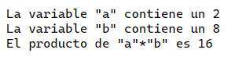
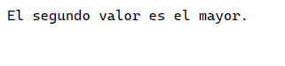

<style>
  h1, h2, h3, h4, h5, h6{
    text-align: center;
    font-weight: bold;
    border: none;
    margin-bottom: 0px;
  }

  p{
    text-align: justify;
  }

  img{
    border: 2px solid black;
  }
</style>

<h1>RELACIÓN 1</h1>

<h4>CHRISTIAN MILLÁN SORIA</h4>

<h4>1º DAW TARDE</h4>

<hr>

<p><b>1. Escribir un mensaje "Hola mundo".</b></p>

```js
document.write("Hola mundo");
```


<p><b>2. Programa que pide un prompt por pantalla donde se nos solicita un nombre y tras introducirlo aparece este mensaje.</b></p>

```
Hola, ¿cómo estás < nombre >?
```

<p>Respuesta:</p>

```js
let dato, resultado;

dato=window.prompt("Introduce tu nombre")
resultado=`Hola, ¿cómo estás ${dato}?`;
document.write(resultado);
```


<p><b>3. Programa que, dadas dos variables "a" y "b" con dos valores predefinidos, se realice el producto de dichas variables y que se muestre por pantalla.</b></p>

```js
let a=2, b=8;

resultadoMulti=a*b;

document.write(`La variable \"a\" contiene un ${a}<br>`);
document.write(`La variable \"b\" contiene un ${b}<br>`);
document.write(`El producto de \"a\"*\"b\" es ${resultadoMulti}`);
```



<p><b>4. Programa que requiere la introducción de un número por un prompt. El resultado de multiplicar ese número por 2 aparece por pantalla.</b></p>

```js
let dato=window.prompt("Introduce un número para saber su multiplicación por 2:", "0"), num=parseInt(dato);

num*=2;

document.write(`El doble de ${dato} es ${num}`);
```


<p><b>5. Programa que requiere de la introducción de dos números por prompt (dos prompts separados). Se muestra el resultado de la suma de estos dos números.</b></p>

```js
let dato1=window.prompt("Introduce el primer número a sumar:", "0"), dato2=window.prompt("Introduce el segundo número a sumar:", "0")

let num1=parseInt(dato1), num2=parseInt(dato2);

let resultadoSuma=num1+num2;

document.write(`La suma de ${num1} y ${num2} da como resultado ${resultadoSuma}.`);
```


<p><b>6. Programa que requiere la introducción de dos números por prompt (separados) y que muestre el resultado de cuál es mayor.</b></p>

```js
let dato1=window.prompt("Introduce el primer número a comparar:", "0"), dato2=window.prompt("Introduce el primer número a comparar:", "0")

let num1=parseInt(dato1), num2=parseInt(dato2);

if(num1>num2){
  document.write("El primer valor es el mayor.");
}else if(num1==num2){
  document.write("Los números son iguales.");
}else{
  document.write("El segundo valor es el mayor.");
}
```




<p><b>7. Programa que requiere la introducción de un número por prompt de forma ininterrumpida. Este número debe ser menor que 10 y debe mostrarse. En el caso de que sea mayor o igual que 10, se para el bucle y muestra un mensaje de que se ha terminado.</b></p>

```js
let dato, num;

function solicitarNumero(){
  dato=window.prompt("Introduce un número menor que 10:", "0");
  num=parseInt(dato);

  document.write(`El número introducido es ${num}<br>`);

  if(num<10){
    setTimeout(solicitarNumero, 333);
  }else{
    document.write("Se ha introducido un número mayor o igual a 10.");
  }
}

solicitarNumero();
```


<p><b>8. Programa que requiere la introducción de un número que representa un mes del año y muestra el número de días que tiene.</b></p>

```js
let input=window.prompt("Introduce el identificador del mes:", "0");

let mes=parseInt(input);

let dias;

switch(mes){
  case 1, 3, 5, 7, 8, 10, 12:
    dias=31;
  break;

  case 2:
    dias=28;
  break;

  case 4, 6, 9, 11:
    dias=31;
  break;
}

document.write(`Ese mes tiene ${dias} días.`);
```


<p><b>9. Evento onclick. Realiza la siguiente pantalla:</b></p>


<p><b>Tras pulsar el botón "Pulsa aquí", se pone en marcha el evento onclick. Sale el mensaje "Hola <nombre >".</nombre></b></p>

```js
// head
  function saludo(nombre){
    document.write(`Hola ${nombre}.`);
  };

// body
  <input type="button" id="saludo" onclick="saludo('Christian')" value="Pulsa aquí">
```

<p><b>10. Tras pulsar el botón "Suma" la función utiliza la sentencia "return" para devolver un valor de suma de dos valores introducidos por teclado en un prompt. Se muestra el resultado de la suma.</b></p>

```js

```