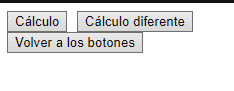
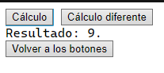
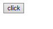
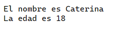

<style>
  h1, h2, h3, h4, h5, h6{
    text-align: center;
    font-weight: bold;
    border: none;
    margin-bottom: 0px;
  }

  p{
    text-align: justify;
  }

  img{
    border: 2px solid black;
  }
</style>

<h1>RELACIÓN 2</h1>

<h4>CHRISTIAN MILLÁN SORIA</h4>

<h4>1º DAW TARDE</h4>

<hr>

<p><b>11. Ejemplo de llamada de función. Dada la siguiente ventana con dos botones, cada uno realiza el cuadrado de un número introducido por código.</b></p>

```html
  <input type="button" onclick="calcula(3)" value="Cálculo">
  <input type="button" onclick="calcula(5)" value="Cálculo diferente">
  <div id="resultado"></div>
  <button onclick="location.reload()">Volver a los botones</button>
```

```js
function calcula(numero){
  let calculo=numero*numero;

  document.getElementById("resultado").innerHTML=`Resultado: ${calculo}.`;
}
```





<p><b>12. </b></p>

```html
<input type="button" onclick="programa()" value="click">
```

```js
class ficha{
  constructor(){
    this.alumno={
      nombre:"Caterina",
      edad:18
    };
  }

  getNombre(){
    return this.alumno.nombre;
  }

  getEdad(){
    let resultado=this.alumno.edad;

    return resultado;
  }
}

function programa(){
  var obj=new ficha();

  document.writeln(`El nombre es ${obj.getNombre()}<br>`);
  document.writeln(`La edad es ${obj.getEdad()}`);
}
```



